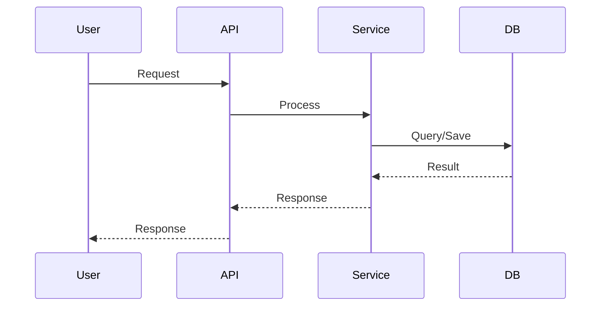

# Architecture

<!--
Intent: Define how the feature fits into the overall system architecture.
Scope: Component diagrams, data flows, integration points, and dependencies on existing systems.
Used by: AI agents to understand where this feature fits and how it interacts with other parts of the system.
-->

## High-Level Overview
[Diagram or description of where this feature sits in the system]

## Component Diagram

### New Components
| Component | Responsibility | Public API |
|-----------|---------------|------------|
| [Component 1] | [What it does] | [API it exposes] |
| [Component 2] | [What it does] | [API it exposes] |

### Modified Components
| Component | Change Description |
|-----------|-------------------|
| [Component 1] | [What changed] |

## Data Flow

### Primary Flow
```
[User/External] --> [Entry Point] --> [Processor] --> [Storage] --> [Response]
```

### Sequence Diagram


## Integration Points

### External Integrations
| Service | Integration Type | Purpose |
|---------|-----------------|---------|
| [Service 1] | [API/Webhook] | [Purpose] |

### Internal Integrations
| Component | Interface | Data Exchanged |
|-----------|-----------|----------------|
| [Component 1] | [API/Event] | [What data] |

## Event Flow (if applicable)
| Event | Producer | Consumer | Payload |
|-------|----------|----------|---------|
| [Event 1] | [Producer] | [Consumer] | [Payload schema] |

## System Boundaries
- **Trusted Zone**: [Components that can be trusted]
- **Untrusted Zone**: [Components that need validation]

## Security Architecture
- [Authentication mechanism]
- [Authorization approach]
- [Data protection measures]