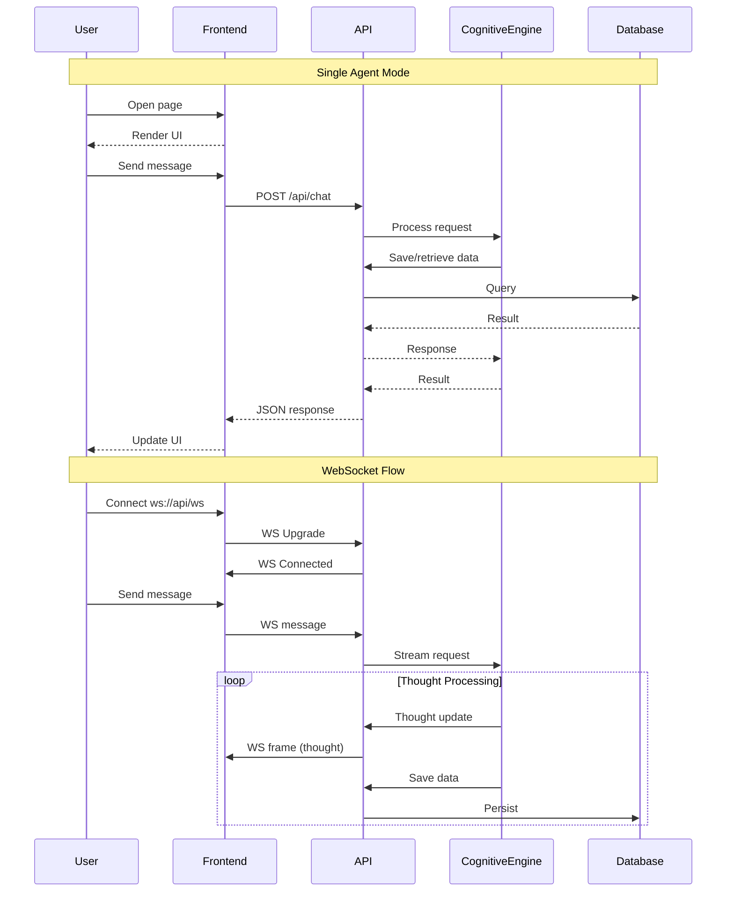

# Architecture

## High-Level Overview

```
┌─────────────────────────────────────────────────────────────────────────┐
│                              ACE Framework                               │
│                                                                          │
│  ┌──────────────┐      ┌──────────────┐      ┌──────────────────────┐  │
│  │   Frontend   │      │    API       │      │   Cognitive Engine  │  │
│  │  SvelteKit   │◄────►│     Go       │◄────►│        Go           │  │
│  │   (Web UI)   │      │    (Gin)     │      │   (6 ACE Layers)   │  │
│  └──────┬───────┘      └──────┬───────┘      └──────────┬───────────┘  │
│         │                      │                         │              │
│         │              ┌───────┴───────┐                 │              │
│         │              │               │                 │              │
│         │         ┌────▼────┐    ┌─────▼─────┐         │              │
│         │         │   Auth   │    │  WebSocket│         │              │
│         │         │   (JWT)  │    │  Handler  │         │              │
│         │         └──────────┘    └───────────┘         │              │
│         │                                               │              │
│         └───────────────────────────────────────────────┼──────────────┘
│                                                         │              │
│                                                         ▼              │
│                                                  ┌───────────┐       │
│                                                  │PostgreSQL │       │
│                                                  │+ SQLC    │       │
│                                                  └───────────┘
└─────────────────────────────────────────────────────────────────────────┘
```

## Component Diagram

### Core Components

| Component | Responsibility | Public API |
|-----------|---------------|------------|
| **Frontend** | User interface, real-time updates | Static + WebSocket |
| **API (Gin)** | HTTP routes, auth, websocket upgrade, orchestration | REST + WS |
| **Cognitive Engine** | 6 ACE layer processing, LLM calls | Internal |
| **Message Broker (NATS)** | Inter-layer communication | Pub/Sub |
| **Auth** | JWT validation, session management | Middleware |
| **Persistence** | Data storage via SQLC | SQL queries |

### Container Architecture

```
┌─────────────────────────────────────────────────────────────────────────┐
│                       Single Agent Mode                                 │
│                                                                          │
│  ┌─────────────┐  ┌─────────────┐  ┌─────────────┐  ┌─────────────┐   │
│  │   frontend  │  │     api     │  │    nats     │  │   postgres  │   │
│  │  :5173      │  │   :8080     │  │  :4222      │  │   :5432     │   │
│  └─────────────┘  └─────────────┘  └─────────────┘  └─────────────┘   │
│                                                                          │
└─────────────────────────────────────────────────────────────────────────┘

### Kubernetes (Multi-Agent)

```
┌─────────────────────────────────────────────────────────────────────────┐
│                      Kubernetes (Multi-Agent)                           │
│                                                                          │
│  ┌─────────────┐  ┌─────────────┐  ┌─────────────┐  ┌─────────────┐   │
│  │   frontend  │  │     api     │  │    nats     │  │  postgres   │   │
│  │  (Deployment)│ │  (Deployment)│ │  (StatefulSet)│ │(Managed)   │   │
│  └─────────────┘  └─────────────┘  └─────────────┘  └─────────────┘   │
│                                                                          │
│  ┌─────────────────────────────────────────────────────────────────┐    │
│  │                     cognitive-engine                            │    │
│  │  ┌─────────┐  ┌─────────┐  ┌─────────┐  ┌─────────┐           │    │
│  │  │ ace-pod │  │ ace-pod │  │ ace-pod │  │ ace-pod │  ...     │    │
│  │  │ :8081   │  │ :8081   │  │ :8081   │  │ :8081   │           │    │
│  │  └─────────┘  └─────────┘  └─────────┘  └─────────┘           │    │
│  └─────────────────────────────────────────────────────────────────┘    │
└─────────────────────────────────────────────────────────────────────────┘
```

## Data Flow

### Single Agent Mode (Embedded)
```
User → Frontend → API → Cognitive Engine → PostgreSQL
```
The API embeds the Cognitive Engine. All DB access goes through the API layer.

### Real-Time Flow (WebSocket)

```
User → Frontend → WebSocket → Cognitive Engine → Thought Stream → User
                                      ↓
                               PostgreSQL (persist)
```

### Layer Communication (NATS)

```
Layer 1 → NATS → Layer 2 → NATS → Layer 3 → ... → Layer 6
```
NATS enables communication between ACE layers within the cognitive engine.

## Sequence Diagram



## Integration Points

### External Integrations

| Service | Integration Type | Purpose |
|---------|-----------------|---------|
| LLM Providers (OpenAI, Anthropic, Ollama) | HTTP API | LLM inference |
| OAuth Providers (future) | OAuth2 | User authentication |

### Internal Integrations

| Component | Interface | Data Exchanged |
|-----------|-----------|----------------|
| Frontend ↔ API | REST + WebSocket | JSON, text stream |
| API ↔ Database | SQLC queries | Structured data |
| Cognitive Engine | Embedded in API | Direct function calls |
| Layer ↔ Layer | NATS | Thought events, layer outputs |

## Event Flow

| Event | Producer | Consumer | Payload |
|-------|----------|----------|---------|
| `layer.input` | Layer N | Layer N+1 | `{ request_id, input, layer }` |
| `layer.output` | Layer N | Layer N+1 | `{ request_id, output, layer }` |
| `thought.start` | Cognitive Engine | Frontend (WS) | `{ agent_id, request_id, layer }` |
| `thought.update` | Cognitive Engine | Frontend (WS) | `{ request_id, thought, layer, metadata }` |
| `thought.complete` | Cognitive Engine | Frontend (WS) | `{ request_id, final, metrics }` |

## System Boundaries

- **Trusted Zone**: API, Cognitive Engine, Database
  - Internal communication within the cluster
  - JWT-authenticated requests
  
- **Untrusted Zone**: Frontend, External LLM Providers
  - Client-side code (browser)
  - External API calls (LLM providers)

## Security Architecture

### Authentication
- JWT tokens for API authentication
- Token validation middleware on all protected routes
- Future: oauth2-proxy for OAuth integration

### Authorization
- Role-based access (future)
- Agent ownership validation
- Session-based authorization

### Data Protection
- HTTPS in production
- SQL injection prevention via SQLC (parameterized queries)
- Input validation on all API endpoints
- Rate limiting (future)

## Network Architecture

### Development
```
localhost:5173 (Frontend) 
    ↓ 
localhost:8080 (API) 
    ↓ 
localhost:5432 (PostgreSQL)
localhost:4222 (NATS)
```

### Production (K8s)
```
Internet → LoadBalancer → frontend (443)
                       → api (443)
                       → nats (443)
                       → postgres (managed)
```
