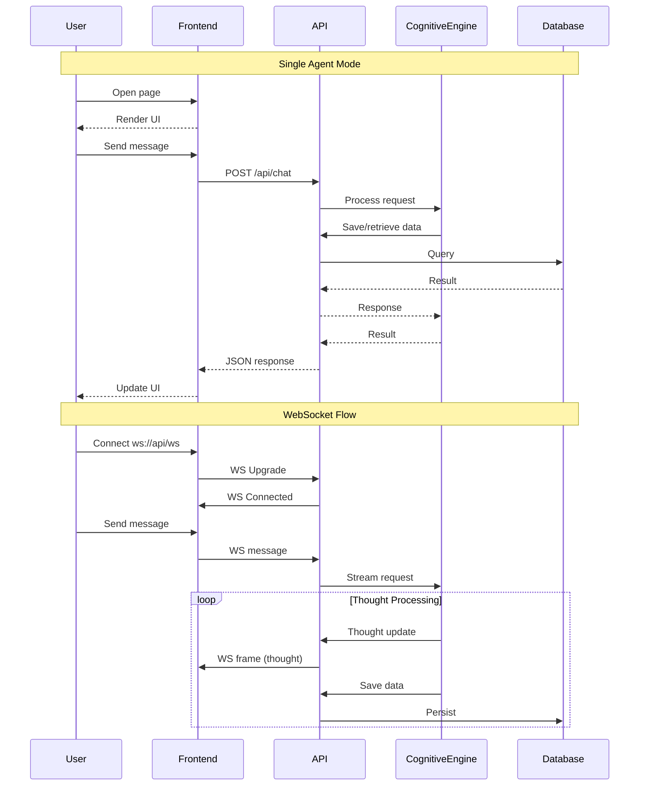

# Architecture

## High-Level Overview

```
┌─────────────────────────────────────────────────────────────────────────┐
│                              ACE Framework                               │
│                                                                          │
│  ┌──────────────┐      ┌──────────────┐      ┌──────────────────────┐  │
│  │   Frontend   │      │    API       │      │   Cognitive Engine  │  │
│  │  SvelteKit   │◄────►│     Go       │◄────►│        Go           │  │
│  │   (Web UI)   │      │    (Gin)     │      │   (6 ACE Layers)   │  │
│  └──────┬───────┘      └──────┬───────┘      └──────────┬───────────┘  │
│         │                      │                         │              │
│         │              ┌───────┴───────┐                 │              │
│         │              │               │                 │              │
│         │         ┌────▼────┐    ┌─────▼─────┐         │              │
│         │         │   Auth   │    │  WebSocket│         │              │
│         │         │   (JWT)  │    │  Handler  │         │              │
│         │         └──────────┘    └───────────┘         │              │
│         │                                               │              │
│         └───────────────────────────┬───────────────────┘              │
│                                     │                                  │
│         ┌───────────────────────────┼───────────────────────────────┐    │
│         │                    Telemetry                               │    │
│         │  ┌─────────────────────────────────────────────────────┐ │    │
│         │  │  Senses: Chat | Sensors | Metrics | Webhooks      │ │    │
│         │  │  Data Distribution: Pull API + Push Events         │ │    │
│         │  └─────────────────────────────────────────────────────┘ │    │
│         └───────────────────────────┬───────────────────────────────┘    │
│                                     │                                  │
│                                     ▼                                  │
│                                                  ┌───────────┐           │
│                                                  │PostgreSQL │           │
│                                                  │+ SQLC    │           │
│                                                  └───────────┘           │
│                                     │                                  │
│                                     ▼ (Layer communication)            │
│                              ┌────────────┐                             │
│                              │    NATS    │                             │
│                              │ (Pub/Sub)  │                             │
│                              └────────────┘                             │
└─────────────────────────────────────────────────────────────────────────┘
```

## Component Diagram

### Core Components

| Component | Responsibility | Public API |
|-----------|---------------|------------|
| **Frontend** | User interface, real-time updates | Static + WebSocket |
| **API (Gin)** | HTTP routes, auth, websocket upgrade, orchestration | REST + WS |
| **Cognitive Engine** | 6 ACE layer processing, LLM calls | Internal |
| **Telemetry (Senses)** | Input handling: chat, sensors, metrics, webhooks | Pull API + Push Events |
| **Message Broker (NATS)** | Inter-layer communication (northbound/southbound buses) | Pub/Sub |
| **Auth** | JWT validation, session management | Middleware |
| **Persistence** | Data storage via SQLC | SQL queries |

### Container Architecture

```
┌─────────────────────────────────────────────────────────────────────────┐
│                       Single Agent Mode                                 │
│                                                                          │
│  ┌─────────────┐  ┌─────────────┐  ┌─────────────┐  ┌─────────────┐   │
│  │   frontend  │  │     api     │  │  telemetry  │  │   nats     │   │
│  │  :5173      │  │   :8080     │  │   :8081    │  │  :4222     │   │
│  └─────────────┘  └─────────────┘  └─────────────┘  └─────────────┘   │
│                                        │                               │
│                                        ▼                               │
│                               ┌─────────────┐                         │
│                               │  postgres   │                         │
│                               │   :5432     │                         │
│                               └─────────────┘                         │
└─────────────────────────────────────────────────────────────────────────┘

### Kubernetes (Multi-Agent)

```
┌─────────────────────────────────────────────────────────────────────────┐
│                      Kubernetes (Multi-Agent)                           │
│                                                                          │
│  ┌─────────────┐  ┌─────────────┐  ┌─────────────┐  ┌─────────────┐   │
│  │   frontend  │  │     api     │  │  telemetry  │  │    nats    │   │
│  │  (Deployment)│ │  (Deployment)│ │  (Deployment)│ │(StatefulSet)│   │
│  └─────────────┘  └─────────────┘  └─────────────┘  └─────────────┘   │
│                                                                          │
│  ┌─────────────┐  ┌─────────────┐                                      │
│  │  postgres   │  │  cognitive-engine                                 │
│  │  (Managed) │  │  (Deployment with HPA)                            │
│  └─────────────┘  └─────────────────────────────────────────────────┘  │
│                                                                          │
│  ┌─────────────────────────────────────────────────────────────────┐    │
│  │                     cognitive-engine                            │    │
│  │  ┌─────────┐  ┌─────────┐  ┌─────────┐  ┌─────────┐           │    │
│  │  │ ace-pod │  │ ace-pod │  │ ace-pod │  │ ace-pod │  ...     │    │
│  │  │ :8081   │  │ :8081   │  │ :8081   │  │ :8081   │           │    │
│  │  └─────────┘  └─────────┘  └─────────┘  └─────────┘           │    │
│  └─────────────────────────────────────────────────────────────────┘    │
└─────────────────────────────────────────────────────────────────────────┘
```

## Data Flow

### Single Agent Mode (Embedded)
```
User → Frontend → API → Cognitive Engine → PostgreSQL
```
The API embeds the Cognitive Engine. All DB access goes through the API layer.

### Real-Time Flow (WebSocket)

```
User → Frontend → WebSocket → Cognitive Engine → Thought Stream → User
                                      ↓
                               PostgreSQL (persist)
```

### Layer Communication (NATS)

```
Layer 1 → NATS → Layer 2 → NATS → Layer 3 → ... → Layer 6
```
NATS enables communication between ACE layers within the cognitive engine.

**Multiple messages per cycle:**
- Each bus message includes: `timestamp`, `cycle_id`, `layer_id`
- All messages with same `cycle_id` aggregated at cycle boundary
- Preserves ordering within cycle for debugging/replay

### Loops within Layers

```
┌─────────────────────────────────────────────────────────────────────────┐
│                    Loops within Layer N                                  │
│                                                                          │
│  Layer N Iteration 1 ──► Spawn Loop 1 ──► runs to completion          │
│        │                                        │                        │
│        │◄───── pull status updates ─────────────┘                        │
│        │                                                                │
│  Layer N Iteration 2 ──► (loop complete, use output)                   │
│        │                                                                │
│  Layer N Iteration 3 ──► Spawn Loop 2 ──► runs to completion          │
│        │                                        │                        │
│        │◄───── pull status updates ─────────────┘                        │
│        │                                                                │
│  Layer N Iteration 4 ──► (loop complete, use output)                   │
└─────────────────────────────────────────────────────────────────────────┘
```

**Loop Types:**

| Type | Behavior | Boundary |
|------|----------|----------|
| **Task Prosecution** | Run until cancelled | Infinite (user terminates) |
| **Planning** | Run until condition met | Finite (max cycles/time) |

**Configuration:**
- Max loops per layer
- Max cycles per loop
- Max time per loop
- Defined in layer config

**Communication:**
- Status updates: Layer pulls from loop (cycle-by-cycle)
- Output: Loop feeds final output to layer on completion

### Global Loops (HRM)

Beyond layer-specific loops, ACE has global loops that operate across the entire cognitive architecture:

```
┌─────────────────────────────────────────────────────────────────────────┐
│                      Global Loops                                        │
│                                                                          │
│  ┌─────────────┐  ┌─────────────┐  ┌─────────────┐  ┌─────────────┐  │
│  │   Chat      │  │   Safety    │  │   Swarm     │  │   Memory    │  │
│  │   Interface │  │   Monitor   │  │   Coord     │  │   Manager   │  │
│  │  (fast)    │  │   (fast)    │  │  (medium)   │  │   (slow)   │  │
│  └──────┬──────┘  └──────┬──────┘  └──────┬──────┘  └──────┬──────┘  │
│         │                │                │                │           │
│         └────────────────┼────────────────┼────────────────┘           │
│                          │                │                             │
│                          ▼                ▼                             │
│                 ┌─────────────────┐ ┌─────────────┐                     │
│                 │  Cognitive      │ │   Learning  │                     │
│                 │  State (shared)│ │    Loop     │                     │
│                 └─────────────────┘ └─────────────┘                     │
└─────────────────────────────────────────────────────────────────────────┘
```

| Global Loop | Purpose | Frequency | Access |
|-------------|---------|-----------|--------|
| **Chat Interface** | Human interaction, bidirectional | Fast | Full cognitive state |
| **Safety Monitor** | Threat detection, emergency stop | Fast (constant) | All layers, sensors |
| **Swarm Coordinator** | Multi-agent communication | Medium | Shared state, agents |
| **Memory Manager** | Consolidation, pruning, retrieval | Slow (periodic) | Long-term memory |
| **Learning Loop** | Feedback integration, adaptation | Medium | All layer outputs |

**HRM Implementation:**
- Global loops run at different frequencies (model sizes)
- Each loop can use different compute (small→fast, large→slow)
- Loops operate in parallel, accessing shared cognitive state
- Enables adaptive computation: more thought on hard problems

### Telemetry (Senses)

```
┌─────────────────────────────────────────────────────────────────────────┐
│                         Telemetry / Senses                               │
│                                                                          │
│  ┌─────────────┐  ┌─────────────┐  ┌─────────────┐  ┌─────────────┐  │
│  │    Chat    │  │   Sensors   │  │  Metrics    │  │  Webhooks   │  │
│  │   Input    │  │   Input     │  │   Input     │  │   Input     │  │
│  └──────┬──────┘  └──────┬──────┘  └──────┬──────┘  └──────┬──────┘  │
│         │                 │                 │                 │         │
│         └─────────────────┼─────────────────┼─────────────────┘         │
│                           ▼                                           │
│                  ┌─────────────────────┐                               │
│                  │   Normalize &       │                               │
│                  │   Validate          │                               │
│                  └──────────┬──────────┘                               │
│                             │                                           │
│                             ▼                                           │
│                  ┌─────────────────────┐                               │
│                  │   Data Distribution │                               │
│                  │                     │                               │
│                  │  Pull API:          │──────► Layer requests context  │
│                  │    Layers pull      │                               │
│                  │                     │                               │
│                  │  Push Events:       │──────► Urgent events to       │
│                  │    Alerts/Immediate│        layers                 │
│                  └─────────────────────┘                               │
└─────────────────────────────────────────────────────────────────────────┘
```

**Pull Model**: Layers request context when ready (handles variable processing speeds)
**Push Model**: Urgent events (alerts, new user messages) pushed immediately

## Sequence Diagram



## Integration Points

### External Integrations

| Service | Integration Type | Purpose |
|---------|-----------------|---------|
| LLM Providers (OpenAI, Anthropic, Ollama) | HTTP API | LLM inference |
| OAuth Providers (future) | OAuth2 | User authentication |

### Internal Integrations

| Component | Interface | Data Exchanged |
|-----------|-----------|----------------|
| Frontend ↔ API | REST + WebSocket | JSON, text stream |
| API ↔ Telemetry | HTTP/gRPC | Sensor data, metrics, chat |
| Telemetry ↔ Layers | Pull API + Push | Context data, events |
| Layer ↔ Layer | NATS | Thought events, layer outputs |
| API ↔ Database | SQLC queries | Structured data |

## Event Flow

| Event | Producer | Consumer | Payload |
|-------|----------|----------|---------|
| `telemetry.chat` | User/Chat | Telemetry | `{ user_id, message, timestamp }` |
| `telemetry.sensor` | Sensors | Telemetry | `{ sensor_id, data, timestamp }` |
| `telemetry.metric` | Metrics | Telemetry | `{ metric_name, value, timestamp }` |
| `telemetry.webhook` | Webhooks | Telemetry | `{ event_type, payload }` |
| `layer.input` | Layer N | Layer N+1 | `{ request_id, input, layer }` |
| `layer.output` | Layer N | Layer N+1 | `{ request_id, output, layer }` |
| `thought.start` | Cognitive Engine | Frontend (WS) | `{ agent_id, request_id, layer }` |
| `thought.update` | Cognitive Engine | Frontend (WS) | `{ request_id, thought, layer, metadata }` |
| `thought.complete` | Cognitive Engine | Frontend (WS) | `{ request_id, final, metrics }` |

## System Boundaries

- **Trusted Zone**: API, Cognitive Engine, Database
  - Internal communication within the cluster
  - JWT-authenticated requests
  
- **Untrusted Zone**: Frontend, External LLM Providers
  - Client-side code (browser)
  - External API calls (LLM providers)

## Security Architecture

### Authentication
- JWT tokens for API authentication
- Token validation middleware on all protected routes
- Future: oauth2-proxy for OAuth integration

### Authorization
- Role-based access (future)
- Agent ownership validation
- Session-based authorization

### Data Protection
- HTTPS in production
- SQL injection prevention via SQLC (parameterized queries)
- Input validation on all API endpoints
- Rate limiting (future)

## Network Architecture

### Development
```
localhost:5173 (Frontend) 
    ↓ 
localhost:8080 (API) 
    ↓ 
localhost:8081 (Telemetry)
    ↓ 
localhost:5432 (PostgreSQL)
localhost:4222 (NATS)
```

### Production (K8s)
```
Internet → LoadBalancer → frontend (443)
                       → api (443)
                       → telemetry (443)
                       → nats (443)
                       → postgres (managed)
```
