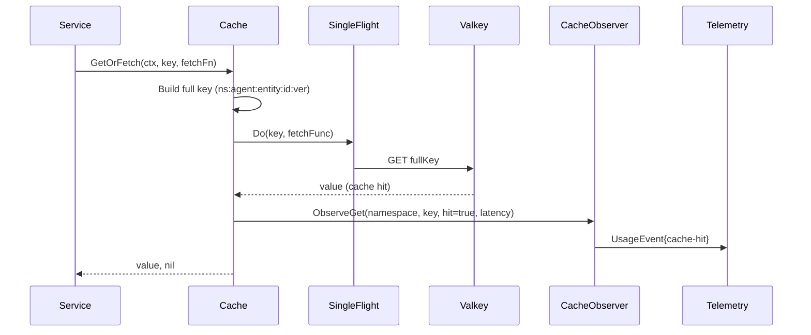
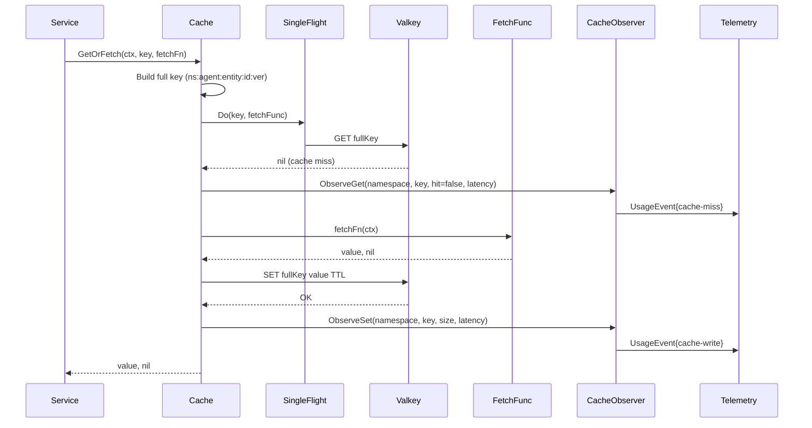
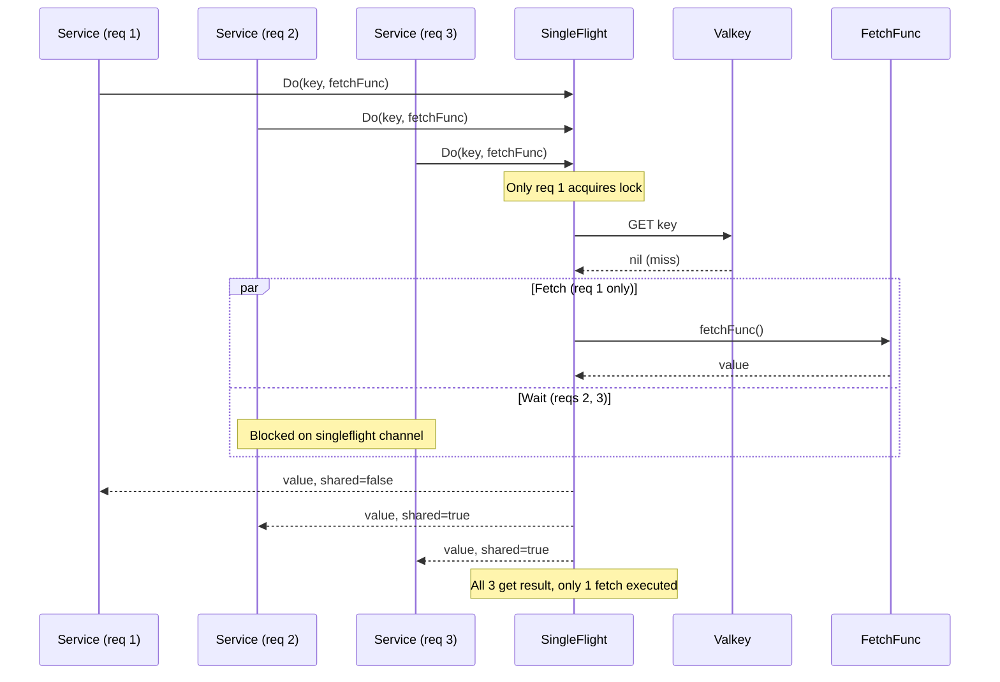

# Architecture — shared/caching

Reference: This architecture fulfills the requirements defined in [fsd.md](./fsd.md).

## High-Level Overview

The `shared/caching` package is a **transport-agnostic caching library** that provides Valkey-backed cache operations, multiple invalidation strategies, stampede protection, and mandatory observability integration. It sits alongside `shared/messaging` and `shared/telemetry` as a foundational shared package imported by all ACE services.

```
┌─────────────────────────────────────────────────────────────────────────┐
│                           ACE Services                                   │
│  ┌──────────┐  ┌──────────┐  ┌──────────┐  ┌────────────────────────┐  │
│  │ace_api   │  │ace_engine│  │ace_memory│  │ Future Services...     │  │
│  └────┬─────┘  └────┬─────┘  └────┬─────┘  └───────────┬────────────┘  │
│       │              │              │                     │              │
│       │    ┌─────────┴──────────────┴─────────────────────┘              │
│       │    │                                                            │
│  ┌────▼────▼──────────────────────────────────────────────────────────┐ │
│  │                      shared/caching                                │ │
│  │  ┌──────────────┐  ┌────────────────┐  ┌──────────────────────┐   │ │
│  │  │ Cache        │  │ Invalidation   │  │ Stampede Protection  │   │ │
│  │  │ Interface    │  │ Strategies     │  │ (singleflight)       │   │ │
│  │  └──────┬───────┘  └───────┬────────┘  └──────────┬───────────┘   │ │
│  │         │                  │                       │               │ │
│  │  ┌──────▼──────────────────▼───────────────────────▼───────────┐  │ │
│  │  │                    CacheBackend                              │  │ │
│  │  │              (valkey-go wrapper)                             │  │ │
│  │  └──────────────────────┬──────────────────────────────────────┘  │ │
│  └─────────────────────────┼──────────────────────────────────────────┘ │
│                            │                                            │
│  ┌─────────────────────────┼──────────────────────────────────────────┐ │
│  │  Observability Layer    │                                          │ │
│  │  ┌──────────────────────▼──────────────────────────────────────┐   │ │
│  │  │              CacheObserver                                   │   │ │
│  │  │   (UsageEvent emission on all operations)                   │   │ │
│  │  └─────────────────────────────────────────────────────────────┘   │ │
│  └─────────────────────────────────────────────────────────────────────┘ │
└─────────────────────────────────────────────────────────────────────────┘
                                │
                    ┌───────────▼───────────┐
                    │       Valkey 8.1+     │
                    │   (sole cache backend) │
                    └───────────────────────┘
```

**Key architectural principles:**
- **Valkey-only**: One backend, one client (`valkey-go`), no pluggable abstraction
- **Transport-agnostic**: No imports of `net/http`, NATS client, or any transport layer
- **Observer pattern**: CacheObserver interface for telemetry; adapters wire `shared/telemetry`
- **Namespace + agentId isolation**: All keys include both for multi-agent safety
- **Follows shared package conventions**: Same pattern as `shared/messaging` and `shared/telemetry`

---

## Component Diagram

### New Components

| Component | Responsibility | Public API |
|-----------|---------------|------------|
| **Cache** (interface) | High-level cache operations for services | `Get`, `Set`, `Delete`, `GetOrFetch`, `GetMany`, `SetMany`, `DeleteMany`, `DeletePattern`, `DeleteByTag`, `InvalidateByVersion`, `WithNamespace`, `WithAgentID`, `WithTTL`, `WithTags`, `Stats` |
| **CacheBackend** (interface) | Low-level Valkey operations wrapper | `Get`, `Set`, `Delete`, `GetMany`, `SetMany`, `DeleteMany`, `DeletePattern`, `DeleteByTag`, `Exists`, `TTL`, `Close` |
| **ValkeyBackend** | Concrete implementation wrapping `valkey-go` | Implements `CacheBackend` |
| **KeyBuilder** | Constructs standardized cache keys | `NewKeyBuilder`, `EntityType`, `EntityID`, `Version`, `Build`, `Pattern` |
| **NamespaceConfig** | Per-namespace configuration | `DefaultTTL`, `MaxSize`, `InvalidationStrategy`, `StampedeProtection`, `WarmingEnabled` |
| **CacheObserver** (interface) | Observability wrapper for all operations | `ObserveGet`, `ObserveSet`, `ObserveDelete`, `ObserveEviction`, `ObserveWarming` |
| **SingleFlight** | Stampede protection via request coalescing | `Do`, `DoChan` (wraps `golang.org/x/sync/singleflight`) |
| **WarmingManager** | Cache warming orchestration | `Warm`, `WarmOnStartup`, `TrackProgress` |

---

## Data Flow

### Primary Flow: Cache-Aside (GetOrFetch)

```
┌──────────┐     ┌───────────────┐     ┌─────────────────┐     ┌────────────┐
│ Service  │────►│ Cache.GetOr   │────►│ singleflight.Do │────►│ Valkey Get │
│ (caller) │     │ Fetch         │     │ (coalesce)      │     │            │
└──────────┘     └───────┬───────┘     └────────┬────────┘     └─────┬──────┘
                         │                      │                    │
                         │              ┌───────▼────────┐    ┌──────▼──────┐
                         │              │ HIT: return     │    │ MISS: call  │
                         │              │ cached value    │    │ fetchFn()   │
                         │              │ + emit UsageEvent│   │ + Set(key)  │
                         │              └────────────────┘    │ + emit event│
                         │                                    └─────────────┘
                         │
               ┌─────────▼──────────┐
               │ CacheObserver      │
               │ emits UsageEvent   │
               │ (hit/miss/write)   │
               └────────────────────┘
```

### Sequence Diagram: Cache Hit



### Sequence Diagram: Cache Miss + Fetch



### Sequence Diagram: Stampede Protection (Concurrent Requests)



### Data Flow: Event-Driven Invalidation

```
┌──────────────┐     ┌──────────────────┐     ┌──────────────────────┐
│ Data Change  │────►│ Service Adapter  │────►│ NATS Publish         │
│ (in service) │     │ (service-internal)│    │ ace.cache.{ns}.inv   │
└──────────────┘     └──────────────────┘     └──────────┬───────────┘
                                                         │
                              ┌───────────────────────────┼───────────────────────┐
                              │                           │                       │
                    ┌─────────▼─────────┐     ┌──────────▼──────────┐  ┌─────────▼─────────┐
                    │ Service B         │     │ Service C           │  │ Service D         │
                    │ NATS Subscriber   │     │ NATS Subscriber     │  │ NATS Subscriber   │
                    └─────────┬─────────┘     └──────────┬──────────┘  └─────────┬─────────┘
                              │                          │                       │
                    ┌─────────▼─────────┐     ┌──────────▼──────────┐  ┌─────────▼─────────┐
                    │ cache.Delete()    │     │ cache.Delete()      │  │ cache.Delete()    │
                    │ or DeletePattern()│     │ or DeletePattern()  │  │ or DeletePattern()│
                    └─────────┬─────────┘     └──────────┬──────────┘  └─────────┬─────────┘
                              │                          │                       │
                    ┌─────────▼─────────┐     ┌──────────▼──────────┐  ┌─────────▼─────────┐
                    │ CacheObserver     │     │ CacheObserver       │  │ CacheObserver     │
                    │ emit cache-inv    │     │ emit cache-inv      │  │ emit cache-inv    │
                    └───────────────────┘     └─────────────────────┘  └───────────────────┘
```

**Important**: The `shared/caching` package does NOT import NATS. Service-internal adapters implement the invalidation handler interface and call `shared/messaging` to wire NATS integration.

### Data Flow: Versioned Invalidation

```
┌──────────┐     ┌──────────────┐     ┌──────────────┐     ┌──────────────┐
│ Service  │────►│ Cache.Get()  │────►│ Valkey GET   │────►│ PostgreSQL   │
│          │     │              │     │ cached entry  │     │ version_stamp│
└──────────┘     └──────────────┘     └──────┬───────┘     └──────┬───────┘
                                             │                     │
                                    ┌────────▼────────┐           │
                                    │ Compare cached  │◄──────────┘
                                    │ version vs DB   │
                                    └────────┬────────┘
                                             │
                                    ┌────────▼────────────────────────┐
                                    │ Match? Return cached.           │
                                    │ Mismatch? Treat as miss,        │
                                    │ fetch + re-cache with new ver.  │
                                    └─────────────────────────────────┘
```

### Data Flow: Cache Warming

```
┌──────────────────┐     ┌────────────────────┐     ┌──────────────┐
│ Service Startup  │────►│ WarmingManager     │────►│ WarmFunc()   │
│ or NATS trigger  │     │ Warm(ctx, deadline)│     │ (per ns)     │
└──────────────────┘     └────────┬───────────┘     └──────┬───────┘
                                  │                        │
                         ┌────────▼───────────┐   ┌────────▼───────┐
                         │ Deadline exceeded? │   │ Batch Set()    │
                         │ Degraded mode      │   │ into Valkey    │
                         │ Warning event      │   │ + Progress     │
                         └────────────────────┘   │ tracking       │
                                                  └────────────────┘
```

---

## Integration Points

### Internal Integrations (shared packages)

| Component | Interface | Data Exchanged |
|-----------|-----------|----------------|
| **shared/telemetry** | `CacheObserver` interface (adapters wire `tel.Usage.Publish()`) | `UsageEvent` with operation type, agentId, namespace, key, latency, size |
| **shared/messaging** | Service-internal adapters (NOT in shared/caching) | `InvalidationEvent` published/subscribed via NATS subjects |
| **shared/database** | SQLC queries for `version_stamps` table | `VersionStamp` records for versioned invalidation |

### External Integrations

| Service | Integration Type | Purpose |
|---------|-----------------|---------|
| **Valkey 8.1+** | TCP (RESP protocol via `valkey-go`) | Cache backend — all read/write operations |
| **PostgreSQL 18** | SQL via SQLC | Version stamp storage for versioned invalidation |
| **NATS 2.12+** | Pub/Sub via service adapters | Cross-service invalidation events, warming triggers |

### Transport-Agnostic Boundary

The `shared/caching` package must NEVER import:
- `net/http` or any HTTP library
- `github.com/nats-io/nats.go` or any NATS client
- Any transport-specific library

Instead:
- `CacheObserver` is an interface — services wire it to `shared/telemetry`
- Invalidation handlers are interfaces — services wire them to `shared/messaging`
- This mirrors how `shared/messaging` and `shared/telemetry` are designed

```
┌─────────────────────────────────────────────────────────────────┐
│                        shared/caching                           │
│  (transport-agnostic — no NATS, no HTTP imports)                │
│                                                                 │
│  Interfaces:                                                    │
│    - CacheObserver    → wired to shared/telemetry by services   │
│    - InvalidationHandler → wired to shared/messaging by services│
│    - CacheBackend     → wired to valkey-go (ValkeyBackend)      │
└─────────────────────────────────────────────────────────────────┘
```

---

## Cache Key Architecture

### Key Format

```
{namespace}:{agentId}:{entityType}:{entityId}:{version}
```

### Key Resolution Flow

```
┌──────────────┐     ┌────────────────┐     ┌────────────────────────────────┐
│ Service      │────►│ KeyBuilder     │────►│ Full key string               │
│ provides:    │     │                │     │ "cognitive-engine:agent-alpha: │
│ - namespace  │     │ namespace ─┐   │     │  decision-tree:tree-456:v3"    │
│ - agentId    │     │ agentId  ──┤   │     └────────────────────────────────┘
│ - entityType │     │ entityType─┤   │
│ - entityId   │     │ entityId ──┤   │
│ - version    │     │ version  ──┘   │
└──────────────┘     └────────────────┘
```

### Key Components

| Component | Source | Example |
|-----------|--------|---------|
| `namespace` | `Config.Namespace` or `WithNamespace()` | `cognitive-engine` |
| `agentId` | `ctx` via `WithAgentID()` (mandatory) | `agent-alpha` |
| `entityType` | `KeyBuilder.EntityType()` | `decision-tree` |
| `entityID` | `KeyBuilder.EntityID()` | `tree-456` |
| `version` | `KeyBuilder.Version()` or auto-generated | `v3` |

### Pattern Generation for Invalidation

The `KeyBuilder.Pattern()` method returns glob patterns for bulk invalidation:

```go
// Invalidate all decision trees for a specific agent
kb := NewKeyBuilder("cognitive-engine", "agent-alpha")
kb.EntityType("decision-tree")
pattern := kb.Pattern()
// Returns: "cognitive-engine:agent-alpha:decision-tree:*"

// Invalidate everything for an agent
kb := NewKeyBuilder("cognitive-engine", "agent-alpha")
pattern := kb.Pattern()
// Returns: "cognitive-engine:agent-alpha:*"
```

---

## Namespace Architecture

### Namespace Configuration

Each namespace defines its own invalidation strategy, TTL, and optional warming:

```go
type NamespaceConfig struct {
    Name               string
    DefaultTTL         time.Duration
    MaxSize            int64
    InvalidationStrategy InvalidationStrategy
    StampedeProtection bool
    WarmingEnabled     bool
    WarmingDeadline    time.Duration
}
```

### Default Namespace Configurations

| Namespace | Default TTL | Invalidation | Warming | Stampede Protection |
|-----------|-------------|--------------|---------|---------------------|
| `cognitive-engine` | 5 min | Hybrid (event + TTL) | Yes (startup) | Yes |
| `memory-manager` | 10 min | Versioned | Yes (startup) | Yes |
| `tool-executor` | 15 min | Event-driven | No | Yes |
| `skill-config` | 30 min | Event-driven | No | No |
| `llm-completions` | 1 hour | TTL-only | No | Yes |
| `embeddings` | 24 hours | Versioned | No | No |

---

## Invalidation Strategy Architecture

### Strategy Selection

```
┌──────────────────────────────────────────────────────────────────────┐
│                    InvalidationStrategy                              │
│                                                                      │
│  ┌─────────────────┐  ┌─────────────────┐  ┌──────────────────────┐ │
│  │ TTL-Based       │  │ Event-Driven    │  │ Versioned            │ │
│  │                 │  │                 │  │                      │ │
│  │ Entry expires   │  │ NATS invalidat- │  │ PostgreSQL version   │ │
│  │ after TTL       │  │ ion event       │  │ stamp comparison     │ │
│  │                 │  │ deletes entry   │  │ on each read         │ │
│  └────────┬────────┘  └────────┬────────┘  └──────────┬───────────┘ │
│           │                    │                       │             │
│           └────────────────────┼───────────────────────┘             │
│                                │                                     │
│                    ┌───────────▼──────────┐                          │
│                    │ Hybrid (Event + TTL) │                          │
│                    │                      │                          │
│                    │ Event = primary      │                          │
│                    │ TTL = safety net     │                          │
│                    │ for missed events    │                          │
│                    └──────────────────────┘                          │
└──────────────────────────────────────────────────────────────────────┘
```

### Strategy Implementations

Each strategy is implemented as a composable layer:

| Strategy | Components | How It Works |
|----------|-----------|--------------|
| **TTL-Based** | Valkey native TTL | Entry stored with `EXPIRE`; Valkey handles eviction |
| **Sliding TTL** | Valkey TTL + Get hook | On cache hit, reset TTL via `EXPIRE` command |
| **Stale-While-Revalidate** | TTL + background goroutine | Serve stale value; spawn goroutine to refresh in background |
| **Event-Driven** | InvalidationHandler interface | Service adapter subscribes to NATS; calls `Delete`/`DeletePattern` |
| **Versioned** | PostgreSQL `version_stamps` table | On read, compare cached version vs DB; mismatch triggers refresh |
| **Hybrid** | Event-driven + TTL | Event-driven primary; TTL catches missed events |

---

## Stampede Protection Architecture

### SingleFlight Integration

```
┌──────────────────────────────────────────────────────────────────────────┐
│                            GetOrFetch                                    │
│                                                                          │
│  ┌────────────────────────────────────────────────────────────────────┐  │
│  │                    singleflight.Group.Do(key, fn)                  │  │
│  │                                                                    │  │
│  │  ┌──────────┐    ┌─────────────────────────────────────────────┐  │  │
│  │  │ Request 1│───►│ Acquire lock for key                        │  │  │
│  │  │ (leader) │    │ Execute: Valkey GET → miss → fetchFn() → SET│  │  │
│  │  └──────────┘    │ Broadcast result to all waiters             │  │  │
│  │                  └─────────────────────────────────────────────┘  │  │
│  │  ┌──────────┐                                                     │  │
│  │  │ Request 2│───► Wait on singleflight channel                    │  │
│  │  │ (waiter) │    │ Receive result from leader                    │  │
│  │  └──────────┘    │ shared=true flag                              │  │
│  │  ┌──────────┐                                                     │  │
│  │  │ Request N│───► Wait on singleflight channel                    │  │
│  │  │ (waiter) │    │ Receive result from leader                    │  │
│  │  └──────────┘                                                     │  │
│  └────────────────────────────────────────────────────────────────────┘  │
└──────────────────────────────────────────────────────────────────────────┘
```

### Configuration

- **Enabled per namespace**: `NamespaceConfig.StampedeProtection = true`
- **Default**: Enabled for all namespaces except `skill-config`
- **Implementation**: Wraps `golang.org/x/sync/singleflight.Group`
- **Key**: The full cache key string (namespace:agentId:entityType:entityId:version)
- **Overhead**: < 0.5ms per operation

### Error Handling

- Fetch errors propagate to all waiters
- No error is cached (waiters can retry)
- Lock is released on completion (success or failure)

---

## Observability Architecture

### CacheObserver Pattern

The `CacheObserver` interface is the **only** observability integration point. Services wire it to `shared/telemetry`:

```go
// In shared/caching — defines the interface
type CacheObserver interface {
    ObserveGet(ctx context.Context, namespace, key string, hit bool, latencyMs float64)
    ObserveSet(ctx context.Context, namespace, key string, sizeBytes int64, latencyMs float64)
    ObserveDelete(ctx context.Context, namespace, key string, reason string)
    ObserveEviction(ctx context.Context, namespace, key string, reason string)
    ObserveWarming(ctx context.Context, namespace string, progress WarmingProgress)
}

// In service-internal code — wires to telemetry
observer := &TelemetryCacheObserver{UsagePublisher: tel.Usage}
cache := caching.NewCache(backend, caching.WithObserver(observer))
```

### UsageEvent Emission

Every cache operation emits a `UsageEvent` via the observer:

| Operation | OperationType | ResourceType | Metadata |
|-----------|--------------|--------------|----------|
| Cache hit | `cache-hit` | `cache` | namespace, key, hit=true, latencyMs |
| Cache miss | `cache-miss` | `cache` | namespace, key, hit=false, latencyMs |
| Cache write | `cache-write` | `cache` | namespace, key, sizeBytes, latencyMs |
| Cache invalidation | `cache-invalidate` | `cache` | namespace, key, reason (ttl/event/manual/version) |
| Cache eviction | `cache-evict` | `cache` | namespace, key, reason (max-size/ttl) |
| Cache warming | `cache-warming` | `cache` | namespace, progress (entries populated/remaining) |

### Metrics Tracked

| Metric | Type | Labels | Purpose |
|--------|------|--------|---------|
| `cache_hits_total` | Counter | namespace, agentId | Hit count per namespace |
| `cache_misses_total` | Counter | namespace, agentId | Miss count per namespace |
| `cache_hit_rate` | Gauge | namespace | Hit rate (hits / (hits + misses)) |
| `cache_latency_ms` | Histogram | namespace, operation | Operation latency distribution |
| `cache_size_bytes` | Gauge | namespace | Current cache size |
| `cache_entry_count` | Gauge | namespace | Number of entries |
| `cache_invalidations_total` | Counter | namespace, reason | Invalidation count by reason |
| `cache_warming_progress` | Gauge | namespace | Warming completion percentage |

---

## Multi-Agent Isolation Architecture

### Isolation Mechanism

Every cache key includes `agentId`, ensuring complete isolation between agents:

```
cognitive-engine:agent-alpha:decision-tree:tree-456:v3
cognitive-engine:agent-beta:decision-tree:tree-456:v3
                ^^^^^^^^^^^
                Different agentId = different keys = no collision
```

### Enforcement Points

1. **Key construction**: `agentId` is mandatory in `KeyBuilder`; missing `agentId` returns error
2. **Context extraction**: `agentId` extracted from `ctx` on every operation; missing = `ErrAgentIDMissing`
3. **Invalidation events**: `InvalidationEvent.AgentID` must match `ctx` agentId
4. **UsageEvent emission**: `agentId` included in every event for cost attribution
5. **Bulk operations**: Results filtered to current agent's keys only

### KeyBuilder Enforcement

```go
// This will return an error — agentId is mandatory
kb := NewKeyBuilder("cognitive-engine", "")
kb.EntityType("decision-tree").EntityID("tree-456").Version("v3")
key, err := kb.Build()
// err: ErrAgentIDMissing

// This works
kb := NewKeyBuilder("cognitive-engine", "agent-alpha")
kb.EntityType("decision-tree").EntityID("tree-456").Version("v3")
key, err := kb.Build()
// key: "cognitive-engine:agent-alpha:decision-tree:tree-456:v3"
```

---

## Cache Warming Architecture

### Startup Warming

```
┌──────────────────┐     ┌─────────────────────┐     ┌──────────────────┐
│ Service Start    │────►│ WarmingManager      │────►│ For each warming │
│                  │     │ Warm(ctx, deadline) │     │ namespace:       │
└──────────────────┘     └─────────────────────┘     │ WarmFunc(ctx,    │
                                                     │   cache)         │
                                                     └────────┬─────────┘
                                                              │
                                                     ┌────────▼─────────┐
                                                     │ Track progress   │
                                                     │ via WarmingProg  │
                                                     │ Emit UsageEvents │
                                                     └────────┬─────────┘
                                                              │
                                                     ┌────────▼─────────┐
                                                     │ Deadline check:  │
                                                     │ Complete? → Ready│
                                                     │ Exceeded? →      │
                                                     │ Degraded mode    │
                                                     └──────────────────┘
```

### NATS-Triggered Warming

Service-internal adapter subscribes to `ace.cache.{namespace}.warm` and calls `WarmingManager.Warm()`:

```
┌──────────────┐     ┌──────────────────┐     ┌──────────────────┐
│ NATS         │────►│ Service Adapter  │────►│ WarmingManager   │
│ ace.cache.   │     │ (wires NATS to   │     │ Warm(ctx,        │
│ {ns}.warm    │     │ warming handler) │     │   deadline)      │
└──────────────┘     └──────────────────┘     └──────────────────┘
```

### Warming Configuration

```go
type WarmingConfig struct {
    Enabled    bool           // Enable warming for this namespace
    Deadline   time.Duration  // Max time to wait for warming
    WarmFunc   WarmFunc       // Function that populates the cache
    OnStartup  bool           // Warm on service startup
    NATSTrigger bool          // Allow NATS-triggered re-warming
}
```

---

## System Boundaries

### Trusted Zone
- `shared/caching` package code
- `valkey-go` client library
- `golang.org/x/sync/singleflight` package
- Service-internal adapters that wire NATS and telemetry

### Untrusted Zone
- Valkey server (external process — connection failures handled gracefully)
- NATS invalidation events (validated on receipt, missing events caught by TTL safety net)
- PostgreSQL version stamps (missing version treated as mismatch, triggers refresh)

### Failure Modes

| Failure | Impact | Mitigation |
|---------|--------|------------|
| Valkey unavailable | All cache operations fail | Graceful degradation — service continues without cache, errors logged and emitted |
| NATS disconnected | Invalidation events missed | TTL safety net catches stale entries (hybrid strategy) |
| PostgreSQL unavailable | Versioned invalidation fails | Fall back to TTL-only for versioned namespaces |
| Singleflight contention | High latency for hot keys | Configurable per namespace; disable for low-contention namespaces |

---

## Deployment Considerations

### Valkey Deployment

**All environments** — Valkey runs via Docker Compose:

```yaml
services:
  valkey:
    image: valkey/valkey:8
    ports:
      - "6379:6379"
    volumes:
      - valkey-data:/data
    command: >
      valkey-server
      --save 60 1
      --loglevel notice
      --io-threads 2
      --io-threads-do-reads yes
    healthcheck:
      test: ["CMD", "valkey-cli", "ping"]
      interval: 10s
      timeout: 5s
      retries: 3
```

### Configuration

| Parameter | Environment Variable | Default | Purpose |
|-----------|---------------------|---------|---------|
| Valkey URL | `VALKEY_URL` | `redis://valkey:6379` | Connection string (redis:// scheme for RESP compat) |
| Max retries | `VALKEY_MAX_RETRIES` | `3` | Retry count on transient failures |
| Dial timeout | `VALKEY_DIAL_TIMEOUT` | `5s` | Connection establishment timeout |
| Read timeout | `VALKEY_READ_TIMEOUT` | `3s` | Per-command read timeout |
| Write timeout | `VALKEY_WRITE_TIMEOUT` | `3s` | Per-command write timeout |
| Pool size | `VALKEY_POOL_SIZE` | `100` | Connection pool size |

### Scalability

| Concern | Approach |
|---------|----------|
| Horizontal scaling | Valkey Cluster support via `valkey-go` (auto-discovery) |
| Memory limits | Per-namespace `MaxSize` with Valkey-native eviction |
| Connection pooling | `valkey-go` auto pipelining — no manual pool tuning needed |
| Stampede protection | `singleflight` per namespace — configurable enable/disable |
| Warming concurrency | Configurable goroutine count (default: 10) |

---
