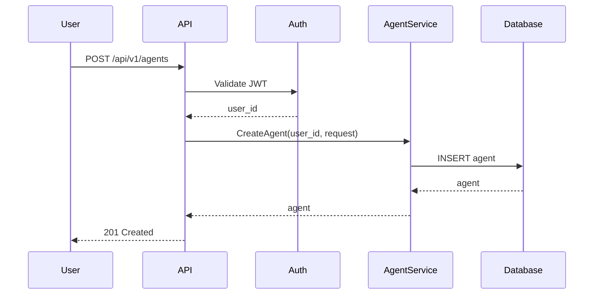
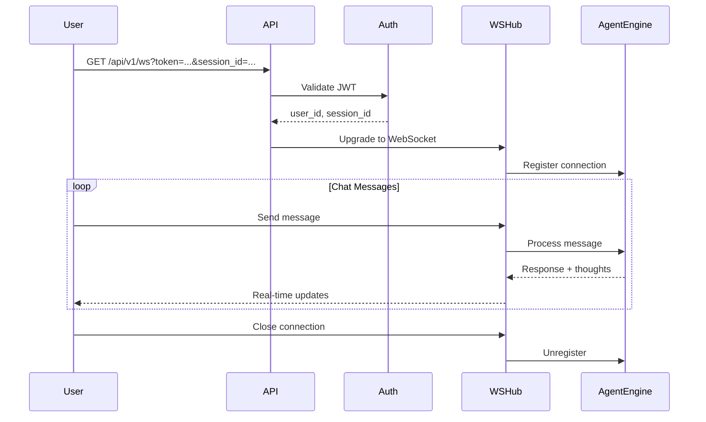

# Architecture

<!--
Intent: Define how the feature fits into the overall system architecture.
Scope: Component diagrams, data flows, integration points, and dependencies on existing systems.
Used by: AI agents to understand where this feature fits and how it interacts with other parts of the system.
-->

## High-Level Overview

The core-infra unit implements the foundational backend infrastructure for the ACE Framework MVP. It provides the API layer, database persistence, authentication, and real-time communication capabilities that all other units depend upon.

```
┌─────────────────────────────────────────────────────────────┐
│                     ACE Framework                           │
├─────────────────────────────────────────────────────────────┤
│                                                             │
│  ┌──────────────┐    ┌──────────────┐    ┌─────────────┐ │
│  │   Frontend   │◄──►│     API      │◄──►│  Database   │ │
│  │  (SvelteKit) │    │    (Go/Gin)  │    │ (PostgreSQL)│ │
│  └──────────────┘    └──────┬───────┘    └─────────────┘ │
│                             │                               │
│                      ┌──────▼───────┐                       │
│                      │  WebSocket   │                       │
│                      │  (Real-time) │                       │
│                      └──────────────┘                       │
│                                                             │
│  ┌───────────────────────────────────────────────────────┐ │
│  │              Core-Infra (This Unit)                   │ │
│  │  • Authentication (JWT)                               │ │
│  │  • User Management                                    │ │
│  │  • Agent CRUD                                         │ │
│  │  • Session Management                                  │ │
│  │  • Thought Recording                                   │ │
│  │  • Memory Storage                                      │ │
│  │  • LLM Provider Config                                 │ │
│  │  • Settings Management                                 │ │
│  │  • Tool Whitelist                                      │ │
│  └───────────────────────────────────────────────────────┘ │
│                                                             │
└─────────────────────────────────────────────────────────────┘
```

## Component Diagram

### New Components

| Component | Responsibility | Public API |
|-----------|---------------|------------|
| API Server | HTTP/WebSocket server, request routing | REST API, WS endpoint |
| Auth Service | JWT token generation and validation | GenerateToken, ValidateToken |
| User Service | User CRUD, authentication | CreateUser, GetUser, UpdateUser, DeleteUser |
| Agent Service | Agent CRUD, lifecycle management | CreateAgent, ListAgents, GetAgent, UpdateAgent, DeleteAgent |
| Session Service | Session creation and management | CreateSession, EndSession, ListSessions |
| Thought Service | Thought recording and retrieval | RecordThought, ListThoughts |
| Memory Service | Memory CRUD and search | CreateMemory, SearchMemories, GetMemory, UpdateMemory, DeleteMemory |
| LLM Provider Service | LLM provider configuration | CreateProvider, ListProviders, GetProvider, UpdateProvider, DeleteProvider |
| Settings Service | Agent and system settings | GetSetting, SetSetting, DeleteSetting |
| Tool Whitelist Service | Tool permissions per agent | GetTools, UpdateTools |

### Modified Components

| Component | Change Description |
|-----------|-------------------|
| None yet | This is the foundational unit |

## Data Flow

### Primary Flow: User Authentication

```
┌─────────┐    ┌─────────┐    ┌─────────────┐    ┌──────────┐    ┌─────────┐
│  Client │───►│  API    │───►│ Auth Svc    │───►│ Database │◄───│ SQLC    │
│ Request │    │ Router  │    │ (JWT/Bcrypt)│    │ (Postgres)│   │ Queries │
└─────────┘    └─────────┘    └─────────────┘    └──────────┘    └─────────┘
                   │                                                  │
                   ▼                                                  ▼
              ┌─────────┐                                      ┌─────────┐
              │ Response│◄─────────────────────────────────────│ Response│
              └─────────┘                                      │ Builder │
```

### Sequence Diagram: Create Agent



### Sequence Diagram: WebSocket Chat



## Integration Points

### External Integrations

| Service | Integration Type | Purpose |
|---------|-----------------|---------|
| OpenAI | HTTP API | LLM inference |
| Anthropic | HTTP API | Claude LLM inference |
| Local LLM | HTTP API | Self-hosted LLM |

### Internal Integrations

| Component | Interface | Data Exchanged |
|-----------|-----------|----------------|
| Frontend | REST API / WebSocket | User actions, agent state |
| Future: Cognitive Engine | Internal API | Session thoughts, memory access |
| Future: Swarm | Internal API | Agent coordination |

## Event Flow

| Event | Producer | Consumer | Payload |
|-------|----------|----------|---------|
| thought.created | Agent Engine | WebSocket | {session_id, layer, content} |
| session.started | Session Service | Frontend | {session_id, agent_id} |
| session.ended | Session Service | Frontend | {session_id, duration} |
| memory.created | Memory Service | Frontend | {memory_id, content} |

## System Boundaries

- **Trusted Zone**: API Server, Services, Database
- **Untrusted Zone**: Client browsers, external LLM APIs

### Security Boundaries

```
┌─────────────────────────────────────────────────────────────┐
│                     Untrusted Zone                          │
│  ┌─────────────────────────────────────────────────────┐   │
│  │              Client Applications                     │   │
│  │  (Browsers, Mobile Apps, External Services)        │   │
│  └────────────────────────┬────────────────────────────┘   │
│                           │                                 │
│                    JWT Token / TLS                         │
│                           │                                 │
└───────────────────────────▼────────────────────────────────┘
                            │
┌───────────────────────────▼────────────────────────────────┐
│                      Trusted Zone                           │
│  ┌─────────────┐  ┌─────────────┐  ┌─────────────────┐    │
│  │   API       │  │  Services   │  │   Database      │    │
│  │  (Gin)      │──│  (Business  │──│  (PostgreSQL)   │    │
│  │             │  │   Logic)    │  │                 │    │
│  └─────────────┘  └─────────────┘  └─────────────────┘    │
│         │                                                │
│  ┌──────▼──────┐                                         │
│  │  WebSocket  │                                         │
│  │   Hub       │                                         │
│  └─────────────┘                                         │
└─────────────────────────────────────────────────────────────┘
```

## Security Architecture

### Authentication

- JWT tokens with RS256 signing
- Access token: 15 minute expiry
- Refresh token: 7 day expiry
- Token passed in Authorization header (Bearer) or WebSocket query param

### Authorization

- Resource-based access control (owner_id)
- Role-based: user, admin
- All service methods validate ownership

### Data Protection

- Passwords: bcrypt with cost factor 12
- API keys: Encrypted at rest (AES-256)
- TLS 1.3 for all connections
- Input validation on all endpoints
