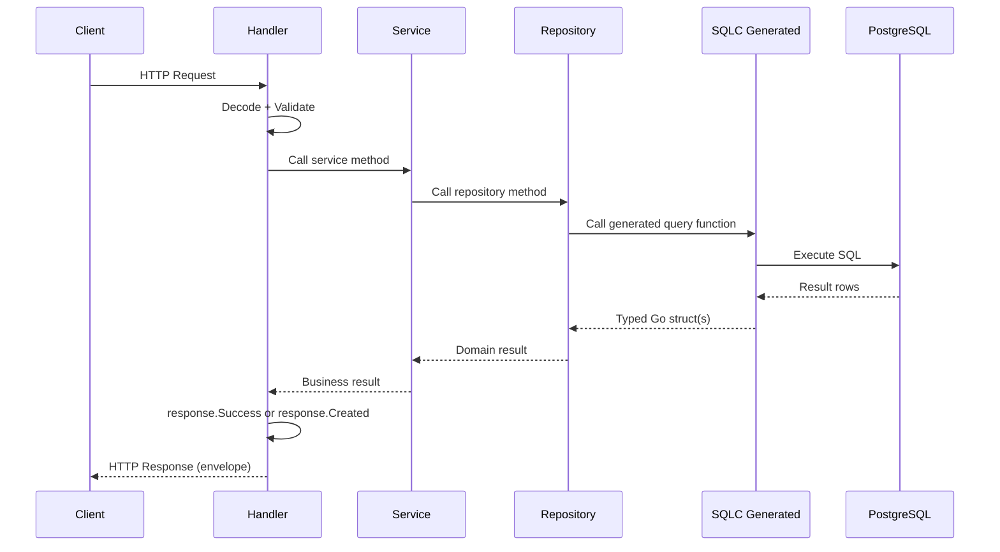

# API/DB Documentation Specification

## Overview

This document defines the approach and specification for creating the API/DB documentation artifacts (FA-2). It is **not** the OpenAPI spec itself — it is the plan for how `documentation/api/openapi.yaml`, `documentation/api/endpoint-map.md`, `documentation/api/errors.md`, and `documentation/database-design/sqlc.md` will be structured, generated, and validated.

The API/DB documentation covers four functional requirements from the FSD:
- **FR-2.1**: OpenAPI Specification — complete OpenAPI 3.x spec for all endpoints
- **FR-2.2**: Endpoint-to-Database Mapping — Handler → Service → Repository → SQLC call chain
- **FR-2.3**: SQLC Workflow Documentation — code generation workflow and query organization
- **FR-2.4**: Error Code Documentation — API error codes and handling patterns

---

## Source Artifacts

The documentation is generated from these existing code artifacts:

| Source | Location | Produces |
|--------|----------|----------|
| Chi router registrations | `backend/services/api/cmd/main.go` (`newRouter`) | Endpoint list for openapi.yaml |
| Handler code | `backend/services/api/internal/handler/*.go` | Request/response schemas, error codes |
| Response package | `backend/services/api/internal/response/response.go` | Standard envelope, error format |
| SQLC config | `backend/services/api/sqlc.yaml` | SQLC workflow docs |
| SQLC query files | `backend/services/api/internal/repository/queries/*.sql` | Query-to-endpoint mapping |
| Generated SQLC code | `backend/services/api/internal/repository/generated/*.go` | Type definitions for openapi.yaml |
| Repository layer | `backend/services/api/internal/repository/db.go` | Connection pooling, transaction patterns |
| Validator | `backend/services/api/internal/validator/validator.go` | Validation rules for request schemas |
| Middleware | `backend/services/api/internal/middleware/*.go` | Auth, CORS, recovery behavior |

---

## Current Route Inventory

Routes are registered in `backend/services/api/cmd/main.go` (`newRouter` function). The documentation generator extracts these from the Chi router setup:

| Method | Path | Handler | Description |
|--------|------|---------|-------------|
| GET | `/` | inline | Root — returns API server identifier |
| GET | `/health/live` | `healthHandler.Live` | Liveness probe |
| GET | `/health/ready` | `healthHandler.Ready` | Readiness probe (DB + NATS checks) |
| GET | `/health/exporters` | `healthHandler.Exporters` | Exporter health (OTLP) |
| GET | `/metrics` | `telemetry.RegisterMetrics()` | Prometheus metrics endpoint |
| POST | `/examples/` | `exampleHandler.Create` | Create example (validation demo) |
| GET | `/examples/{id}` | `exampleHandler.Get` | Get example by ID |

As new routes are added via `r.Route(...)` or `r.Method(...)`, the documentation generator will automatically pick them up from the Chi router source.

---

## OpenAPI Specification Structure (FR-2.1)

### Output

`documentation/api/openapi.yaml` — OpenAPI 3.1, machine-readable YAML.

### Generation Strategy

**Primary: Annot8** — Purpose-built for the Chi + SQLC + pgx/v5 stack. Generates OpenAPI 3.1 specs from Go code annotations with zero configuration. Supports both runtime and static file generation.

**Fallback: swaggo/swag** — If Annot8 proves insufficient, swaggo's mature ecosystem provides a reliable alternative with Chi adapter.

Per research recommendation (research.md §3).

### Annotation Pattern

Handlers are annotated with OpenAPI metadata comments. Example using the existing `ExampleHandler`:

```go
// Create handles POST /examples
//
//	@Summary      Create an example
//	@Description  Create a new example with validation
//	@Tags         examples
//	@Accept       json
//	@Produce      json
//	@Param        request body CreateExampleRequest true "Example to create"
//	@Success      201 {object} response.APIResponse{data=ExampleResponse}
//	@Failure      400 {object} response.APIResponse{error=response.APIError}
//	@Router       /examples [post]
func (h *ExampleHandler) Create(w http.ResponseWriter, r *http.Request) {
    // ...
}
```

Annot8 discovers the Chi route, request type (`CreateExampleRequest`), and response type (`ExampleResponse`) from the Go struct definitions. The `response.APIResponse` envelope is documented as a reusable component.

### Spec Organization

The OpenAPI spec follows this structure:

```yaml
openapi: 3.1.0
info:
  title: ACE API
  version: 1.0.0
  description: ACE Framework API — autonomous agent cognitive engine

servers:
  - url: http://localhost:8080
    description: Development

paths:
  /health/live:
    get:
      operationId: healthLive
      summary: Liveness probe
      responses:
        "200":
          description: Service is alive
          content:
            application/json:
              schema:
                $ref: "#/components/schemas/HealthResponse"

  /health/ready:
    get:
      operationId: healthReady
      summary: Readiness probe
      responses:
        "200":
          description: All dependencies healthy
        "503":
          description: One or more dependencies degraded

  /examples:
    post:
      operationId: createExample
      summary: Create an example
      requestBody:
        required: true
        content:
          application/json:
            schema:
              $ref: "#/components/schemas/CreateExampleRequest"
      responses:
        "201":
          description: Created
          content:
            application/json:
              schema:
                $ref: "#/components/schemas/SuccessResponse_ExampleResponse"
        "400":
          description: Validation error
          content:
            application/json:
              schema:
                $ref: "#/components/schemas/ErrorResponse"

components:
  schemas:
    # Reusable envelope types
    SuccessResponse:
      type: object
      properties:
        success:
          type: boolean
          enum: [true]
        data:
          type: object

    ErrorResponse:
      type: object
      properties:
        success:
          type: boolean
          enum: [false]
        error:
          $ref: "#/components/schemas/APIError"

    APIError:
      type: object
      properties:
        code:
          type: string
        message:
          type: string
        details:
          type: array
          items:
            $ref: "#/components/schemas/FieldError"

    FieldError:
      type: object
      properties:
        field:
          type: string
        message:
          type: string

    # Request/response types (auto-discovered from Go structs)
    CreateExampleRequest:
      type: object
      required: [name, email]
      properties:
        name:
          type: string
          minLength: 1
          maxLength: 100
        email:
          type: string
          format: email

    ExampleResponse:
      type: object
      properties:
        id:
          type: string
        name:
          type: string
        email:
          type: string

    HealthResponse:
      type: object
      properties:
        status:
          type: string
        checks:
          type: object
```

### Makefile Integration

```makefile
# Included in the docs target (architecture.md §Makefile Integration)
docs:
	go run ./scripts/docs-gen/
```

The `docs-gen` script runs Annot8 as part of the generation pipeline. Validation uses `swagger-cli validate` or `redocly lint` on the generated YAML.

---

## Response Envelope Pattern

All API responses use the standard envelope defined in `backend/services/api/internal/response/response.go`. The OpenAPI spec documents this as reusable components.

### Success Envelope

```json
{
  "success": true,
  "data": { /* resource or collection */ }
}
```

Go type: `response.APIResponse` with `Success: true` and `Data` populated.

### Error Envelope

```json
{
  "success": false,
  "error": {
    "code": "validation_error",
    "message": "Invalid request data",
    "details": [
      { "field": "name", "message": "This field is required" },
      { "field": "email", "message": "Invalid email format" }
    ]
  }
}
```

Go type: `response.APIResponse` with `Success: false` and `Error` populated.

### Response Helper Functions (FR-2.4)

The `response` package provides typed helper functions that map directly to HTTP status codes:

| Function | HTTP Status | Error Code | Use Case |
|----------|-------------|------------|----------|
| `response.Success(w, data)` | 200 | — | Successful read |
| `response.Created(w, data)` | 201 | — | Successful create |
| `response.BadRequest(w, code, msg)` | 400 | caller-provided | Invalid request |
| `response.ValidationError(w, err)` | 400 | `validation_error` | Struct validation failure |
| `response.Unauthorized(w, msg)` | 401 | `unauthorized` | Missing/invalid auth |
| `response.Forbidden(w, msg)` | 403 | `forbidden` | Insufficient permissions |
| `response.NotFound(w, msg)` | 404 | `not_found` | Resource not found |
| `response.InternalError(w, msg)` | 500 | `internal_error` | Server error |

Each helper is documented as a named response in the OpenAPI spec under `components/responses/`.

---

## Authentication Documentation (FR-2.1)

The FSD acceptance criteria for FR-2.1 requires: "Auth requirements specified per endpoint." The OpenAPI spec documents authentication per endpoint using OpenAPI security schemes.

### OpenAPI Security Scheme

The spec defines a Bearer token security scheme in `components/securitySchemes`:

```yaml
components:
  securitySchemes:
    BearerAuth:
      type: http
      scheme: bearer
      bearerFormat: JWT
```

### Per-Endpoint Security

Each endpoint declares its auth requirement using the `security` field in the OpenAPI spec:

```yaml
# Public endpoint (no auth required)
/health/live:
  get:
    security: []   # Explicitly public — no authentication
    responses:
      "200":
        description: Service is alive

# Protected endpoint (Bearer token required)
/agents:
  post:
    security:
      - BearerAuth: []
    responses:
      "201":
        description: Created
      "401":
        description: Missing or invalid token
      "403":
        description: Insufficient permissions
```

Public endpoints use `security: []` to explicitly indicate no authentication is required. Protected endpoints use `security: [BearerAuth: []]` to require a JWT Bearer token.

### Current State

The current codebase has **no JWT auth middleware**. The middleware stack (registered in `newRouter` in `backend/services/api/cmd/main.go`) consists of:

| Middleware | Purpose | Auth Impact |
|-----------|---------|-------------|
| `middleware.CORS(...)` | CORS headers | None — infrastructure only |
| `middleware.Logger` | Request logging | None — infrastructure only |
| `middleware.Recovery` | Panic recovery | None — infrastructure only |
| `telemetry.TraceMiddleware()` | OpenTelemetry tracing | None — observability only |
| `telemetry.MetricsMiddleware("api")` | Prometheus metrics | None — observability only |
| `telemetry.LoggerMiddleware("api")` | Structured logging | None — observability only |

**All current endpoints (`/health/*`, `/examples/*`, `/metrics`) are public.** When JWT auth middleware is added to a route group (e.g., `r.Group(func(r chi.Router) { r.Use(auth.Middleware); r.Route("/agents", ...) })`), the documentation generator will detect it and add `security: [BearerAuth: []]` to all endpoints in that group.

### Annot8 Annotation Pattern

Handlers can explicitly declare security requirements via Annot8 annotations:

```go
// Create handles POST /agents
//
//	@Summary      Create an agent
//	@Security     BearerAuth
//	@Tags         agents
//	@Router       /agents [post]
func (h *AgentHandler) Create(w http.ResponseWriter, r *http.Request) {
    // ...
}
```

When `@Security BearerAuth` is present, Annot8 adds the security requirement to that endpoint. When omitted and no auth middleware is detected, the endpoint defaults to public (`security: []`).

---

## Error Code Taxonomy (FR-2.4)

Error codes follow snake_case convention and are organized by HTTP status. The full catalog is output to `documentation/api/errors.md`.

### Error Code Catalog

| HTTP Status | Error Code | When It Occurs | Client Handling |
|-------------|------------|----------------|-----------------|
| 400 | `invalid_request` | JSON decode failure | Fix request body format |
| 400 | `validation_error` | Struct validation fails (`validator.ValidateStruct`) | Check `details` array for field-level errors |
| 400 | `bad_request` | General bad request | Read `message` for details |
| 401 | `unauthorized` | Missing or invalid JWT token | Re-authenticate |
| 403 | `forbidden` | Valid token, insufficient permissions | Request elevated permissions |
| 404 | `not_found` | Resource does not exist | Verify resource ID |
| 409 | `conflict` | Unique constraint violation | Check for duplicates |
| 500 | `internal_error` | Unhandled server error | Retry with backoff, report if persistent |

### Database-to-API Error Mapping

Database errors are mapped to API error codes in the service/handler layer:

| PostgreSQL Error | SQLState | API Status | API Error Code |
|-----------------|----------|------------|----------------|
| Unique violation | 23505 | 409 | `conflict` |
| Foreign key violation | 23503 | 404 | `not_found` |
| Not null violation | 23502 | 400 | `bad_request` |
| Check constraint | 23514 | 400 | `bad_request` |
| Connection refused | 08001 | 503 | `service_unavailable` |
| Query timeout | 57014 | 504 | `timeout` |

This mapping is documented in `documentation/api/errors.md` and referenced in the OpenAPI spec.

### Validation Error Format

The `response.ValidationError` function produces field-level error details from `go-playground/validator`:

```json
{
  "success": false,
  "error": {
    "code": "validation_error",
    "message": "Invalid request data",
    "details": [
      { "field": "Name", "message": "This field is required" },
      { "field": "Email", "message": "Invalid email format" }
    ]
  }
}
```

The `details` array maps each `validator.FieldError` to a human-readable message via `formatValidationMessage` (supported tags: `required`, `email`, `min`, `max`, `url`).

---

## SQLC Workflow Documentation (FR-2.3)

Output: `documentation/database-design/sqlc.md`.

### Current Configuration

From `backend/services/api/sqlc.yaml`:

| Setting | Value | Documentation Note |
|---------|-------|-------------------|
| Engine | `postgresql` | PostgreSQL-specific features supported |
| Queries | `internal/repository/queries` | One `.sql` file per domain |
| Schema | `migrations` | Goose migrations as schema source |
| Output | `internal/repository/generated` | Generated code target |
| Package | `db` | Go package name for generated code |
| SQL driver | `pgx/v5` | PostgreSQL-native driver |
| JSON tags | `snake_case` | Matches PostgreSQL column naming |
| Result structs | Pointers | Nullable fields as `*Type` |

### Query Organization Convention

Queries are organized one file per domain entity:

```
backend/services/api/internal/repository/queries/
├── agents.sql          # Agent CRUD queries
├── memory.sql          # Memory node queries
├── tools.sql           # Tool invocation queries
├── usage.sql           # Usage event queries
└── system.sql          # System/pod queries
```

Each file contains all SQLC-annotated queries for that domain.

### SQLC Annotation Syntax

Documented with examples for each return type:

```sql
-- Single row return
-- name: GetAgentByID :one
SELECT * FROM agents WHERE id = $1 AND deleted_at IS NULL;

-- Multiple rows return
-- name: ListAgentsByUserID :many
SELECT * FROM agents WHERE user_id = $1 AND deleted_at IS NULL
ORDER BY created_at DESC
LIMIT $2 OFFSET $3;

-- Execute without return
-- name: DeleteAgent :exec
UPDATE agents SET deleted_at = NOW() WHERE id = $1;

-- Exec with row count
-- name: UpdateAgentStatus :execrows
UPDATE agents SET status = $2, updated_at = NOW() WHERE id = $1;
```

### Generation Workflow

```
1. Edit .sql query file in internal/repository/queries/
2. Run: sqlc generate
3. Generated Go code appears in internal/repository/generated/
4. Use generated types in repository layer
5. NEVER hand-edit files in internal/repository/generated/
```

### Generated Output Files

| File | Contents | Hand-Editable |
|------|----------|---------------|
| `db.go` | `DBTX` interface, `Queries` struct, `New()`, `WithTx()` | No |
| `models.go` | Go structs for each table | No |
| `querier.go` | `Querier` interface with all query methods | No |
| `*.sql.go` | One file per query file with implementation | No |

**Note:** With `emit_interface: false` in `sqlc.yaml`, `querier.go` will not contain the `Querier` interface. The file still exists but contains only the `DBTX` interface and `Queries` struct (same as `db.go` in some SQLC versions). If `emit_interface` is changed to `true`, `querier.go` will contain a `Querier` interface that abstracts all query methods — useful for mocking in tests.

---

## Endpoint-to-DB Mapping Approach (FR-2.2)

Output: `documentation/api/endpoint-map.md`.

### Call Chain Pattern

Every endpoint follows the Handler → Service → Repository → SQLC pattern:



### Mapping Table Format

Each endpoint produces one row in the mapping table:

| Endpoint | Handler | Service | Repository | SQLC Query | Transaction | Notes |
|----------|---------|---------|------------|------------|-------------|-------|
| `POST /examples/` | `ExampleHandler.Create` | (inline) | — | — | No | Validation demo, no DB |
| `GET /examples/{id}` | `ExampleHandler.Get` | (inline) | — | — | No | Validation demo, no DB |
| `GET /health/ready` | `HealthHandler.Ready` | — | — | — | No | Direct `pool.Ping()` |
| `POST /agents/` | `AgentHandler.Create` | `AgentService.Create` | `AgentRepo.Create` | `CreateAgent :one` | Yes | Future endpoint |
| `GET /agents/{id}` | `AgentHandler.Get` | `AgentService.GetByID` | `AgentRepo.GetByID` | `GetAgentByID :one` | No | Future endpoint |

As the codebase grows, this table expands. The documentation generator extracts mappings by tracing:
1. Chi route → handler function (from `newRouter`)
2. Handler → service call (from handler body)
3. Service → repository call (from service body)
4. Repository → SQLC function call (from repository body)

### Data Transformation Documentation

For each endpoint, document transformations between layers:

```
Request JSON → Go struct (handler decode)
    → Validated struct (validator.ValidateStruct)
        → Domain type (service layer)
            → SQLC params (repository layer)
                → SQL parameters (SQLC generated)
```

And the reverse for responses:

```
SQL result rows → SQLC model (generated)
    → Domain type (repository layer)
        → Response type (service layer)
            → JSON envelope (response.Success/.Created)
```

---

## Validation Approach

The OpenAPI spec and related documentation are validated through the pipeline defined in `architecture.md` §Validation Flow.

### OpenAPI Spec Validation

| Check | Tool | When | Failure |
|-------|------|------|---------|
| YAML syntax | `swagger-cli validate` or `redocly lint` | Pre-commit, CI | Invalid YAML structure |
| Schema completeness | Custom check | CI | Missing request/response for any endpoint |
| Example validity | Annot8 built-in | Generation | Invalid example JSON |
| Diff detection | `make test` dry-run | CI | Spec doesn't match generated output |

### Endpoint Map Validation

| Check | Method | Failure |
|-------|--------|---------|
| Route coverage | Compare Chi routes vs documented endpoints | Any undocumented route |
| SQLC reference | Verify SQLC query file exists for each reference | Missing query file |
| Transaction boundary | Code analysis for `db.BeginTx()` | Undocumented transaction |

### Error Code Validation

| Check | Method | Failure |
|-------|--------|---------|
| Code coverage | Scan handler code for `response.Error()` calls | Undocumented error code |
| Status mapping | Verify HTTP status matches response function | Status code mismatch |
| DB error mapping | Verify PostgreSQL error codes documented | Missing SQLState mapping |

---

## Agent Integration (FR-6.1)

The OpenAPI spec feeds into agent-facing documentation per the architecture's agent integration layer:

- `documentation/api/openapi.yaml` → `documentation/agents/api-reference.md` (machine-parseable endpoint summaries)
- Error code taxonomy → included in `documentation/agents/patterns.md` (constraint-first quick reference)
- Endpoint map → referenced in `documentation/agents/training/new-endpoint.md` (full workflow guide)

Agents consume the OpenAPI YAML directly for type generation and the markdown docs for guidance on patterns and constraints.

---

## Constraints

1. **Standard envelope**: All responses use `{ "success": true, "data": {...} }` or `{ "success": false, "error": {...} }` (design/README.md)
2. **Handler → Service → Repository**: All business logic lives in the service layer, never in the handler (design/README.md)
3. **SQLC generated files are never hand-edited**: Modify `.sql` files and run `sqlc generate` (design/README.md)
4. **No `interface{}` or `any`**: Explicit types throughout (design/README.md, applies to new code)
5. **agentId attribution**: Agent-attributed endpoints must include `agent_id` in request/response schemas (design/README.md)
6. **Chi router**: All routes registered via Chi; OpenAPI generator must be Chi-aware (architecture.md)
7. **OpenAPI 3.1**: Spec follows OpenAPI 3.1.0 (Annot8 default, latest standard)
8. **Version control**: Spec changes in same PR as handler changes (NFR-4)
