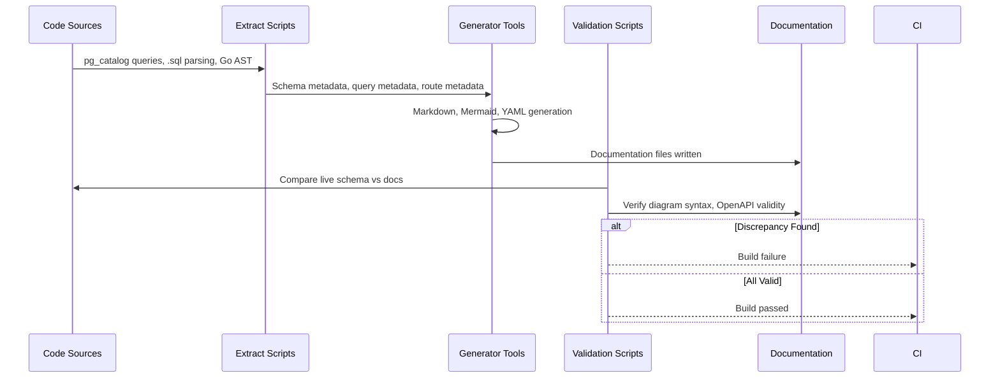
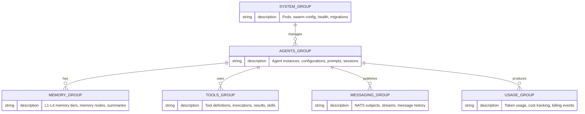
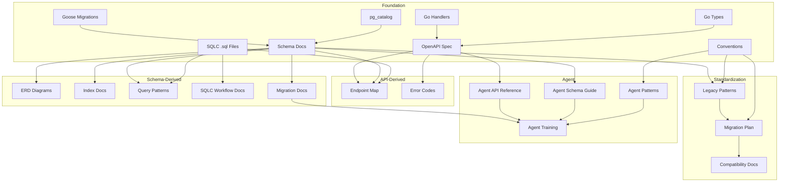
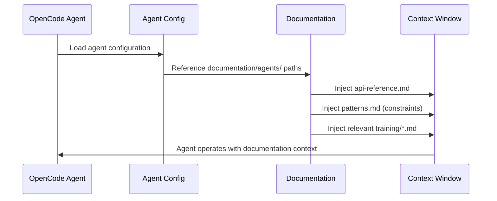

# Architecture — Database Design Documentation Unit

## High-Level Overview

The database-design unit is a **documentation system**, not a runtime service. It produces authoritative documentation for the ACE Framework's data layer by extracting information from source code artifacts (migrations, SQLC queries, handlers), generating structured documentation (markdown, Mermaid, YAML), and validating that documentation stays in sync with the live schema.

The documentation system has three layers: **Sources** (code artifacts that define truth), **Generators** (tools that extract and transform source data), and **Outputs** (documentation artifacts consumed by developers and agents).

```
┌─────────────────────────────────────────────────────────────────────┐
│                        SOURCE LAYER                                  │
│  ┌──────────┐  ┌──────────┐  ┌──────────┐  ┌──────────┐            │
│  │ Goose    │  │ SQLC     │  │ Chi      │  │ Go       │            │
│  │ Migrations│  │ Queries  │  │ Handlers │  │ Types    │            │
│  └────┬─────┘  └────┬─────┘  └────┬─────┘  └────┬─────┘            │
│       │              │              │              │                  │
└───────┼──────────────┼──────────────┼──────────────┼─────────────────┘
        │              │              │              │
        ▼              ▼              ▼              ▼
┌─────────────────────────────────────────────────────────────────────┐
│                      GENERATOR LAYER                                 │
│  ┌──────────────┐  ┌──────────────┐  ┌──────────────┐              │
│  │ Go Schema    │  │ SQL → Mermaid│  │ Annot8       │              │
│  │ Doc Script   │  │ Generator    │  │ (OpenAPI)    │              │
│  └──────┬───────┘  └──────┬───────┘  └──────┬───────┘              │
│         │                 │                  │                       │
│  ┌──────┴───────┐  ┌──────┴───────┐  ┌──────┴───────┐              │
│  │ Go Validation│  │ Mermaid CLI  │  │ OpenAPI      │              │
│  │ Script       │  │ (mmdc)       │  │ Validator    │              │
│  └──────┬───────┘  └──────┬───────┘  └──────┬───────┘              │
└─────────┼─────────────────┼─────────────────┼───────────────────────┘
          │                 │                 │
          ▼                 ▼                 ▼
┌─────────────────────────────────────────────────────────────────────┐
│                       OUTPUT LAYER                                   │
│  ┌─────────────────────────────────────────────────────────────┐    │
│  │               documentation/database-design/                │    │
│  │  schema/  erd/  indexes.md  query-patterns/  conventions.md │    │
│  │  sqlc.md  connection-pooling.md  transactions.md            │    │
│  │  query-helpers.md  migrations.md  legacy-patterns.md        │    │
│  │  migration-plan.md  compatibility.md                        │    │
│  └─────────────────────────────────────────────────────────────┘    │
│  ┌─────────────────────────────────────────────────────────────┐    │
│  │                    documentation/api/                        │    │
│  │              openapi.yaml  endpoint-map.md  errors.md       │    │
│  └─────────────────────────────────────────────────────────────┘    │
│  ┌─────────────────────────────────────────────────────────────┐    │
│  │                  documentation/agents/                       │    │
│  │  api-reference.md  schema-generation.md  patterns.md       │    │
│  │  config-updates.md  training/                               │    │
│  └─────────────────────────────────────────────────────────────┘    │
│  ┌─────────────────────────────────────────────────────────────┐    │
│  │                    tests/agent-integration/                  │    │
│  │              (Go test files verifying agent doc usage)       │    │
│  └─────────────────────────────────────────────────────────────┘    │
└─────────────────────────────────────────────────────────────────────┘
```

---

## Documentation Pipeline (FR-1.1, FR-1.4, FR-2.1, FR-2.3, FR-4.1)

The documentation pipeline transforms source code artifacts into validated, version-controlled documentation. It runs in three phases: **Extract**, **Generate**, and **Validate**.

### Pipeline Flow



### Phase 1: Extract

Source artifacts are read and metadata is extracted:

| Source | Extraction Method | Extracted Data |
|--------|------------------|----------------|
| Goose migrations | File system scan + `pg_catalog` queries | Tables, columns, types, constraints, indexes, triggers |
| SQLC `.sql` files | Comment parsing (`-- name:` annotations) | Query names, parameter types, return types |
| Chi router | Go source analysis | Route registrations, handler functions |
| Go types | Go AST or struct reflection | Request/response schemas, validation tags |
| `pg_catalog` | Direct SQL queries | Live schema state for validation |

### Phase 2: Generate

Extracted metadata is transformed into documentation:

| Generator | Input | Output | Component |
|-----------|-------|--------|-----------|
| Schema Doc Generator | `pg_catalog` metadata | `documentation/database-design/schema/*.md` | `schema-doc-gen` (FR-1.1) |
| ERD Generator | Foreign key metadata | `documentation/database-design/erd/*.md` | `erd-gen` (FR-1.2) |
| OpenAPI Generator | Chi routes + Go types | `documentation/api/openapi.yaml` | `openapi-gen` / Annot8 (FR-2.1) |
| Pattern Docs | Manual authoring + code review | `documentation/database-design/conventions.md` | Manual (FR-3.1, FR-3.2) |
| Agent Docs | All above + AGENTS.md patterns | `documentation/agents/*.md` | Manual (FR-6.1 through FR-6.5) |

### Phase 3: Validate

Documentation is verified against live schema:

| Validation | Method | Failure Condition |
|------------|--------|-------------------|
| Schema sync | Custom Go script compares `pg_catalog` vs markdown | Any table/column mismatch |
| ERD syntax | `mmdc` validates Mermaid syntax | Invalid Mermaid syntax |
| OpenAPI validity | `swagger-cli validate` or `redocly lint` | Invalid OpenAPI YAML |
| Markdown lint | Markdown linter for formatting | Formatting violations |
| Staleness check | Git commit age on documentation files | >30 days without review |

---

## Entity Groupings (FR-1.2)

Database entities are organized into six groups. Each group produces its own ERD and schema documentation (per FR-1.2).



| Group | Tables (Expected) | Key Relationships | ERD File |
|-------|-------------------|-------------------|----------|
| Agents | `agents`, `agent_configs`, `agent_prompts`, `sessions` | User ownership, config versioning | `erd/agents.md` |
| Memory | `memory_nodes`, `memory_summaries`, `memory_tiers` | Agent ownership, parent-child tree | `erd/memory.md` |
| Tools | `tools`, `tool_invocations`, `skills`, `agent_skills` | Agent ownership, result tracking | `erd/tools.md` |
| Messaging | `message_history`, `stream_metadata` | Agent attribution, correlation IDs | `erd/messaging.md` |
| Usage | `usage_events`, `cost_tracking`, `billing_periods` | Agent attribution, operation types | `erd/usage.md` |
| System | `pods`, `swarm_config`, `goose_db_version` | Pod hierarchy, system-level config | `erd/system.md` |

A **master ERD** (`erd/master.md`) shows all groups and cross-group relationships.

---

## Dependency Graph

Documentation artifacts have explicit dependencies on each other and on source code. This graph determines generation order.



### Dependency Table

| Output Artifact | Depends On | Generation Order |
|----------------|------------|------------------|
| Schema docs (`schema/`) | Migrations, `pg_catalog` | 1 (foundation) |
| ERD diagrams (`erd/`) | Schema docs | 2 |
| Index docs (`indexes.md`) | Schema docs | 2 |
| Query patterns (`query-patterns/`) | Schema docs, SQLC files | 2 |
| SQLC workflow (`sqlc.md`) | SQLC config, `.sql` files | 2 |
| Conventions (`conventions.md`) | Schema analysis | 2 |
| OpenAPI spec (`openapi.yaml`) | Chi handlers, Go types | 2 (parallel with schema) |
| Endpoint map (`endpoint-map.md`) | OpenAPI spec, Schema docs, SQLC files | 3 |
| Error codes (`errors.md`) | OpenAPI spec, Handler code | 3 |
| Connection pooling (`connection-pooling.md`) | Database config | 2 |
| Transactions (`transactions.md`) | Repository code analysis | 2 |
| Query helpers (`query-helpers.md`) | Repository code, shared packages | 2 |
| Migration docs (`migrations.md`) | Goose files, migration strategy | 2 |
| Legacy patterns (`legacy-patterns.md`) | Schema docs, Conventions | 3 |
| Migration plan (`migration-plan.md`) | Legacy patterns, Conventions | 4 |
| Compatibility (`compatibility.md`) | Migration plan, API contracts | 4 |
| Agent API reference (`agents/api-reference.md`) | OpenAPI spec | 3 |
| Agent schema guide (`agents/schema-generation.md`) | Schema docs | 3 |
| Agent patterns (`agents/patterns.md`) | Conventions, all pattern docs | 3 |
| Agent training (`agents/training/`) | All agent docs, migration docs | 5 |
| Agent config updates (`agents/config-updates.md`) | Agent docs, OpenAPI spec | 5 |
| Agent integration tests (`tests/agent-integration/`) | Agent config updates, all agent docs | 5 |

---

## Source Mapping

Each source code artifact maps to specific documentation outputs:

### Goose Migrations
```
backend/services/api/migrations/*.go
    ↓
documentation/database-design/schema/{table}.md    (one per table)
documentation/database-design/erd/{group}.md       (ERD per entity group)
documentation/database-design/indexes.md           (index summary)
documentation/database-design/migrations.md        (migration patterns)
```

### SQLC Query Files
```
backend/services/api/db/queries/*.sql
    ↓
documentation/database-design/query-patterns/*.md  (pattern categories)
documentation/database-design/sqlc.md               (SQLC workflow)
documentation/api/endpoint-map.md                   (query-to-endpoint mapping)
```

### Chi Router + Handlers
```
backend/services/api/cmd/main.go                  (route registrations)
backend/services/api/internal/handler/*.go        (handler implementations)
    ↓
documentation/api/openapi.yaml                      (API specification)
documentation/api/endpoint-map.md                   (endpoint-to-query mapping)
documentation/api/errors.md                         (error code catalog)
```

### Go Types
```
backend/services/api/internal/models/*.go
backend/services/api/db/sqlc/*.go (generated)
    ↓
documentation/api/openapi.yaml                      (request/response schemas)
documentation/api/endpoint-map.md                   (data transformations)
```

### pg_catalog (Live Database)
```
PostgreSQL system tables (pg_class, pg_attribute, etc.)
    ↓
documentation/database-design/schema/*.md           (validation source)
documentation/database-design/erd/*.md              (ERD generation source)
```

### FA-5: Standardization Sources (FR-5.1, FR-5.2, FR-5.3, FR-5.4)
```
Schema analysis + existing code review
    ↓
documentation/database-design/legacy-patterns.md    (legacy pattern catalog)
documentation/database-design/conventions.md        (current conventions)

legacy-patterns.md + conventions.md + API contracts
    ↓
documentation/database-design/migration-plan.md     (phased migration plan)
documentation/database-design/compatibility.md      (backward compatibility rules)
```

### FA-6: Agent Documentation Sources (FR-6.1, FR-6.2, FR-6.3, FR-6.4, FR-6.5)
```
documentation/api/openapi.yaml
    ↓
documentation/agents/api-reference.md               (agent API reference, FR-6.1)

documentation/database-design/schema/*.md
    ↓
documentation/agents/schema-generation.md           (schema-aware generation, FR-6.2)

documentation/database-design/conventions.md + all pattern docs
    ↓
documentation/agents/patterns.md                    (agent pattern guidelines, FR-6.3)

All agent docs + migration docs + AGENTS.md patterns
    ↓
documentation/agents/training/*.md                  (scenario training, FR-6.4)

Agent config files + agent docs + OpenAPI spec
    ↓
documentation/agents/config-updates.md              (config update process, FR-6.5)
tests/agent-integration/*.go                        (integration tests, FR-6.5)
```

---

## Validation Flow (FR-1.1, FR-4.3, NFR-1)

Documentation freshness is enforced through a three-tier validation system: **pre-commit**, **CI/CD**, and **periodic**. Per FR-1.1 acceptance criteria, an automated validation script must verify documentation matches the live schema. Per NFR-1, documentation must be updated within 1 sprint of code changes.

### Pre-Commit Hook

When a commit touches schema-related files (migrations, SQLC queries, handlers):

```
Git commit
  └─ Pre-commit hook detects schema-related changes
      ├─ Runs Go validation script
      │   └─ Extracts live schema from pg_catalog
      │   └─ Compares against documentation markdown
      │   └─ Fails if discrepancy found
      ├─ Runs mmdc on changed Mermaid files
      │   └─ Fails if syntax invalid
      └─ Runs OpenAPI validator on openapi.yaml
          └─ Fails if spec invalid
```

### CI/CD Pipeline

Every PR touching database-related files:

```
PR created/updated
  └─ CI pipeline triggered
      ├─ Step 1: Documentation generation (dry-run)
      │   └─ Generate docs from current source
      │   └─ Diff against committed docs
      │   └─ Fail if docs not updated
      ├─ Step 2: Schema validation
      │   └─ Run migrations on test DB
      │   └─ Compare live schema vs documentation
      │   └─ Fail on any mismatch
      ├─ Step 3: Diagram validation
      │   └─ Validate all .md files with Mermaid blocks
      │   └─ Fail on syntax errors
      └─ Step 4: OpenAPI validation
          └─ Validate openapi.yaml against spec
          └─ Fail on invalid spec
```

### Periodic Staleness Check

A scheduled job (weekly) checks documentation freshness:

```
Scheduled job (weekly)
  └─ For each documentation file
      ├─ Check last git commit date
      ├─ Check if related source files changed after last doc update
      └─ Create issue if stale (>30 days without review)
```

### Validation Script Architecture

The custom Go validation script (`scripts/validate-docs/main.go`) follows this flow:

```go
// 1. Connect to PostgreSQL
pool, err := pgxpool.New(ctx, connString)
if err != nil {
    return fmt.Errorf("failed to connect to database: %w", err)
}
defer pool.Close()

// 2. Extract live schema from pg_catalog
tables, err := extractTables(ctx, pool)
if err != nil {
    return fmt.Errorf("failed to extract tables: %w", err)
}
columns, err := extractColumns(ctx, pool)
if err != nil {
    return fmt.Errorf("failed to extract columns: %w", err)
}
constraints, err := extractConstraints(ctx, pool)
if err != nil {
    return fmt.Errorf("failed to extract constraints: %w", err)
}
indexes, err := extractIndexes(ctx, pool)
if err != nil {
    return fmt.Errorf("failed to extract indexes: %w", err)
}

// 3. Parse documentation markdown files
docTables, err := parseSchemaDocs("documentation/database-design/schema/")
if err != nil {
    return fmt.Errorf("failed to parse documentation: %w", err)
}

// 4. Compare and report discrepancies
liveSchema := buildSchema(tables, columns, constraints, indexes)
discrepancies := compare(liveSchema, docTables)

// 5. Exit with error code if discrepancies found
if len(discrepancies) > 0 {
    for _, d := range discrepancies {
        fmt.Fprintf(os.Stderr, "DISCREPANCY: %s\n", d)
    }
    os.Exit(1)
}
```

---

## Makefile Integration

Per `design/README.md`: "All operations go through the Makefile." Documentation generation is a single entry point, consistent with the project's Makefile philosophy (`make test`, `make up`, `make build` — one target per concern).

### Target

| Makefile Target | Description | Trigger |
|-----------------|-------------|---------|
| `make docs` | Generate, validate, and lint all documentation | Manual, pre-commit, CI |

### Implementation

```makefile
# Generate all documentation, validate against schema, lint markdown
docs:
	go run ./scripts/docs-gen/
```

The `docs-gen` script handles the full pipeline internally: extract schema → generate markdown/ERDs/OpenAPI → validate against live schema → lint markdown formatting → check staleness. This keeps the Makefile surface area minimal while the script owns the complexity.

### CI/CD Integration

```
CI Pipeline
  └─ make docs    (generate + validate + lint in one step)
```

---

## Agent Integration Architecture

Agent-facing documentation follows the AGENTS.md pattern (Linux Foundation standard) and is structured for context injection into agent sessions.

### Agent Documentation Hierarchy (FR-6.1 through FR-6.5)

```
documentation/agents/
├── api-reference.md           ← Machine-parseable endpoint summaries (FR-6.1)
├── schema-generation.md       ← SQLC/Goose generation workflows (FR-6.2)
├── patterns.md                ← Constraint-first quick reference (FR-6.3)
├── config-updates.md          ← Agent config update process & validation (FR-6.5)
└── training/                  ← Scenario-based training guides (FR-6.4)
    ├── adding-a-table.md      ← Step-by-step scenario guide
    ├── adding-a-column.md     ← Migration approach guide
    ├── new-endpoint.md        ← Full workflow guide
    └── debugging-queries.md   ← Investigation approach guide
tests/agent-integration/       ← Integration tests verifying agent doc usage (FR-6.5)
```

### Agent Context Injection Flow



### Agent Documentation Structure (AGENTS.md Pattern)

Each agent-facing document follows this structure:

1. **Role** — What this documentation helps the agent do
2. **Project Knowledge** — Key facts about the ACE data layer
3. **Commands** — Executable steps (sqlc generate, goose up, etc.)
4. **Code Style** — Naming conventions, type patterns
5. **Boundaries** — NEVER/ALWAYS constraints
6. **Examples** — Code generation templates
7. **Validation** — How to verify correctness

### Agent Config Integration (FR-6.5)

Agent configurations are updated to reference documentation paths. Per `design/README.md`, agentId threads through every message, row, span, and log line — agent documentation must reference this pattern so agents always include agentId in generated code.

```yaml
# Agent tool configuration additions
context_directories:
  - documentation/database-design/schema/
  - documentation/database-design/conventions.md
  - documentation/api/openapi.yaml
  - documentation/agents/patterns.md

prompt_templates:
  migration_generation:
    reference: documentation/agents/training/adding-a-table.md
  sqlc_query_generation:
    reference: documentation/agents/schema-generation.md
  api_endpoint_creation:
    reference: documentation/agents/training/new-endpoint.md
```

The config update workflow (documented in `documentation/agents/config-updates.md`) covers:
1. Adding documentation paths to agent tool context directories
2. Configuring documentation lookup tools to use new paths
3. Updating agent prompt templates to reference documented patterns
4. Running integration tests in `tests/agent-integration/` to verify:
   - Agents can load and reference API documentation
   - Agents generate code following documented patterns (including agentId inclusion)
   - Agent outputs comply with naming conventions and schema awareness

### agentId Attribution in Documentation (FR-1.1, FR-6.2)

Per `design/README.md`: "agentId threads through every message, row, span, and log line because attribution is the foundation of everything." The documentation system must propagate this constraint:

- **Schema docs** (FR-1.1): Document which tables include an `agent_id` column and its role in cost attribution, Layer Inspector tracing, and swarm debugging
- **Agent docs** (FR-6.2): Include agentId as a required field in code generation templates — agents must always include `agent_id UUID NOT NULL` with foreign key to `agents` table and index `idx_{table}_agent_id`
- **Query patterns** (FR-1.4): Document query patterns that filter by `agent_id` for attribution-scoped operations
- **Validation scripts**: Tag validation results with the agentId/context of the invoking agent for audit trail
- **Agent constraints** (FR-6.3): Include "ALWAYS add `agent_id` column to agent-attributed tables" in the schema constraint checklist

---

## Documentation Generation Sequence

Based on the dependency graph, documentation must be generated in this order:

### Generation Order

| Order | Artifacts | Rationale |
|-------|-----------|-----------|
| 1 | Schema docs (`schema/`) | Foundation — all other docs reference schema |
| 1 | Conventions (`conventions.md`) | Foundation — defines standards for all docs |
| 1 | OpenAPI spec (`openapi.yaml`) | Parallel foundation — independent of schema docs |
| 2 | ERD diagrams (`erd/`) | Depends on schema docs |
| 2 | Index docs (`indexes.md`) | Depends on schema docs |
| 2 | Query patterns (`query-patterns/`) | Depends on schema docs + SQLC files |
| 2 | SQLC workflow (`sqlc.md`) | Depends on SQLC config + queries |
| 2 | Connection pooling (`connection-pooling.md`) | Independent — config documentation |
| 2 | Transactions (`transactions.md`) | Independent — pattern documentation |
| 2 | Query helpers (`query-helpers.md`) | Depends on code analysis |
| 2 | Migration docs (`migrations.md`) | Depends on Goose files |
| 3 | Endpoint map (`endpoint-map.md`) | Depends on OpenAPI + schema + SQLC |
| 3 | Error codes (`errors.md`) | Depends on OpenAPI + handler code |
| 3 | Legacy patterns (`legacy-patterns.md`) | Depends on schema + conventions |
| 3 | Agent API reference (`agents/api-reference.md`) | Depends on OpenAPI spec |
| 3 | Agent schema guide (`agents/schema-generation.md`) | Depends on schema docs |
| 3 | Agent patterns (`agents/patterns.md`) | Depends on conventions |
| 4 | Migration plan (`migration-plan.md`) | Depends on legacy patterns + conventions |
| 4 | Compatibility (`compatibility.md`) | Depends on migration plan + API contracts |
| 5 | Agent training (`agents/training/`) | Depends on all agent docs + migration docs |
| 5 | Agent config updates (`agents/config-updates.md`) | Depends on agent docs + OpenAPI spec (FR-6.5) |
| 5 | Agent integration tests (`tests/agent-integration/`) | Depends on config updates (FR-6.5) |

### Parallel Generation Opportunities

These artifacts can be generated simultaneously (no dependencies between them):

- **Batch 1 (parallel)**: Schema docs, Conventions, OpenAPI spec
- **Batch 2 (parallel)**: ERD, Indexes, Query patterns, SQLC docs, Connection pooling, Transactions, Query helpers, Migration docs
- **Batch 3 (parallel)**: Endpoint map, Error codes, Legacy patterns, Agent API reference, Agent schema guide, Agent patterns
- **Batch 4 (sequential)**: Migration plan → Compatibility
- **Batch 5 (sequential)**: Agent training (after all above complete)

---

## Component Responsibilities

### Documentation Generators (FR-1.1, FR-1.2, FR-1.3, FR-2.1, FR-2.2)

| Component | Responsibility | Input | Output |
|-----------|---------------|-------|--------|
| `schema-doc-gen` | Extract schema from `pg_catalog` | PostgreSQL connection | `schema/*.md` files |
| `erd-gen` | Generate Mermaid ERD from FK metadata | Schema metadata | `erd/*.md` files |
| `openapi-gen` | Generate OpenAPI from Chi + Go types | Annot8 annotations | `openapi.yaml` |
| `index-doc-gen` | Extract and document indexes | Schema metadata | `indexes.md` |
| `pattern-analyzer` | Analyze code for pattern documentation | Go source files | Pattern markdown files |

### Documentation Validators

| Component | Responsibility | Input | Output |
|-----------|---------------|-------|--------|
| `schema-validator` | Compare live schema vs docs | `pg_catalog` + markdown | Pass/fail + discrepancies |
| `mermaid-validator` | Validate Mermaid syntax | `.md` files with Mermaid | Pass/fail + syntax errors |
| `openapi-validator` | Validate OpenAPI spec | `openapi.yaml` | Pass/fail + spec errors |
| `staleness-checker` | Check documentation freshness | Git history | Staleness report |

### Documentation Consumers

| Consumer | Documentation Used | Access Pattern |
|----------|-------------------|----------------|
| Backend developers | Schema docs, Query patterns, SQLC docs | Direct file read |
| Frontend developers | OpenAPI spec, Endpoint map, Error codes | Direct file read |
| DevOps | Migration docs, Connection pooling | Direct file read |
| OpenCode agents | `documentation/agents/` (incl. `config-updates.md`) | Context injection |
| CI/CD pipeline | All docs | Validation scripts |
| Integration tests | Agent docs + OpenAPI spec | `tests/agent-integration/` (FR-6.5) |

---

## System Boundaries

### Documentation Scope (In-Bounds)

- Schema documentation generated from `pg_catalog` and migrations
- OpenAPI specification generated from Chi handlers and Go types
- ERD diagrams generated from foreign key metadata
- Pattern documentation authored from code analysis
- Agent-facing documentation following AGENTS.md pattern
- Validation scripts ensuring documentation freshness

### External Dependencies (Out-of-Bounds)

- PostgreSQL runtime (source of truth, not modified)
- SQLC code generation (existing tool, not modified)
- Goose migration execution (existing tool, not modified)
- Chi router registration (existing code, not modified)
- OpenCode agent runtime (consumer of docs, not modified)

---

## Scalability Considerations

### As Schema Grows

- **Per-table schema docs**: Scales linearly with table count (one file per table)
- **ERD diagrams**: Entity grouping prevents diagram complexity explosion
- **Query patterns**: Category-based organization allows incremental addition
- **Validation time**: `pg_catalog` queries are fast regardless of schema size

### As Endpoints Grow

- **OpenAPI spec**: Single YAML file, grows linearly with endpoint count
- **Endpoint map**: Table-based format scales well
- **Annot8 generation**: Tested with 340+ models (per research)

### As Agents Scale

- **Agent docs**: Structured markdown with token budgets prevents context overflow
- **Training materials**: Scenario-based approach allows incremental addition
- **Context injection**: Shallow hierarchy (H1 → H2 → H3) matches agent parsing patterns

### Estimated Generation/Validation Times (Current Schema Baseline)

| Operation | Estimated Time | Scaling Factor |
|-----------|---------------|----------------|
| `schema-doc-gen` (full) | < 5s | +0.5s per table |
| `erd-gen` (all groups) | < 2s | +0.2s per entity group |
| `openapi-gen` (Annot8) | < 10s | +1s per 50 endpoints |
| `schema-validator` (pg_catalog) | < 3s | +0.3s per table |
| `mermaid-validator` (all diagrams) | < 5s | +0.5s per diagram |
| `openapi-validator` | < 2s | Linear with spec size |
| Full pipeline (`make docs-all`) | < 30s | Dominated by generation |

Times are for the current schema size and will scale as noted. CI/CD overhead is dominated by PostgreSQL test database setup, not documentation generation.

---

## Constraints

1. **All documentation lives in version control** alongside code (NFR-4)
2. **Documentation changes must be in the same PR** as related code changes (NFR-4)
3. **OpenAPI spec must be valid YAML** parseable by standard tools (NFR-5)
4. **Agent docs must be structured for context injection** (NFR-5)
5. **Documentation must be updated within 1 sprint** of code changes (NFR-1)
6. **SQLC generated files are never hand-edited** (global constraint)
7. **All documentation output is text-based** (markdown, Mermaid, YAML) for version-control compatibility
8. **No external service dependencies** — documentation is generated and validated locally
