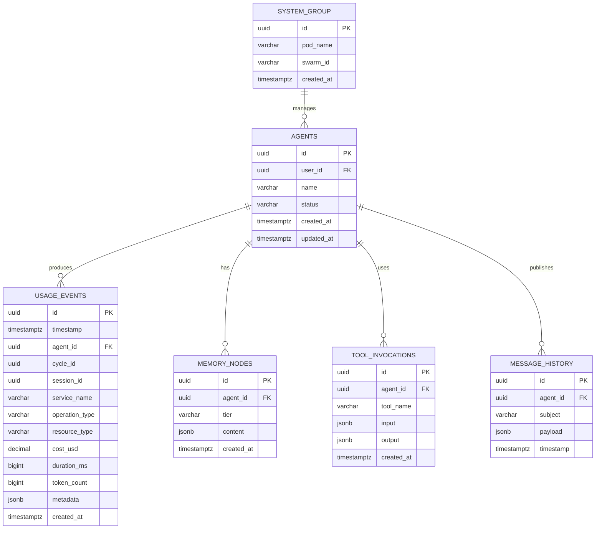

# Master ERD

**FSD Requirement**: FR-1.2

---

## Overview

This is the master Entity-Relationship Diagram showing all entity groups and their relationships within the ACE Framework data layer. Currently only the Usage entity group has a physical table (`usage_events`). Other groups are documented as planned entities.

---

## Master Diagram

---

## Usage Entity Group

The only entity group with physical tables currently implemented.

### Tables

| Table | Purpose | Status |
|-------|---------|--------|
| `usage_events` | Per-operation usage tracking for billing and attribution | **Implemented** |

### Relationships

- `usage_events.agent_id` → `agents.id` (planned, FK not yet enforced)
- `usage_events.cycle_id` → cycles (planned)
- `usage_events.session_id` → sessions (planned)

### Cascade Behavior

- **No CASCADE deletes currently defined.** Foreign key constraints are deferred until referenced tables are created.
- **Soft delete**: Not implemented on `usage_events`. Usage events are immutable — they represent historical facts and should never be deleted (only archived).

---

## Entity Group Overview (Planned)

| Group | Tables (Planned) | Key Relationships | Status |
|-------|-------------------|-------------------|--------|
| Agents | `agents`, `agent_configs`, `agent_prompts`, `sessions` | User ownership, config versioning | Planned |
| Memory | `memory_nodes`, `memory_summaries`, `memory_tiers` | Agent ownership, parent-child tree | Planned |
| Tools | `tools`, `tool_invocations`, `skills`, `agent_skills` | Agent ownership, result tracking | Planned |
| Messaging | `message_history`, `stream_metadata` | Agent attribution, correlation IDs | Planned |
| Usage | `usage_events`, `cost_tracking`, `billing_periods` | Agent attribution, operation types | **Implemented** (1 table) |
| System | `pods`, `swarm_config`, `goose_db_version` | Pod hierarchy, system-level config | Partially planned |

---

## Cross-Group Relationships

| From | To | Relationship | Notes |
|------|----|-------------|-------|
| Agents | Usage | 1:N | Each agent produces many usage events |
| Agents | Memory | 1:N | Each agent has many memory nodes |
| Agents | Tools | 1:N | Each agent invokes many tools |
| Agents | Messaging | 1:N | Each agent publishes many messages |
| System | Agents | 1:N | System manages many agents |

---

## Notes

- ERDs will expand as new tables are added via migrations.
- Each entity group has its own detailed ERD in `erd/{group}.md` (created as groups are implemented).
- Mermaid syntax is validated by `mmdc` CLI in CI/CD pipeline.
