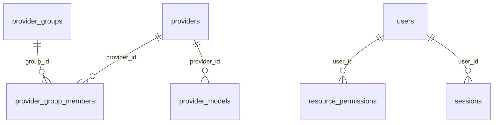

# Entity Relationship Diagram

```mermaid
erDiagram
    providers ||--o{ provider_group_members : "provider_id"
    provider_groups ||--o{ provider_group_members : "group_id"
    providers ||--o{ provider_models : "provider_id"
    users ||--o{ resource_permissions : "user_id"
    users ||--o{ sessions : "user_id"
```
