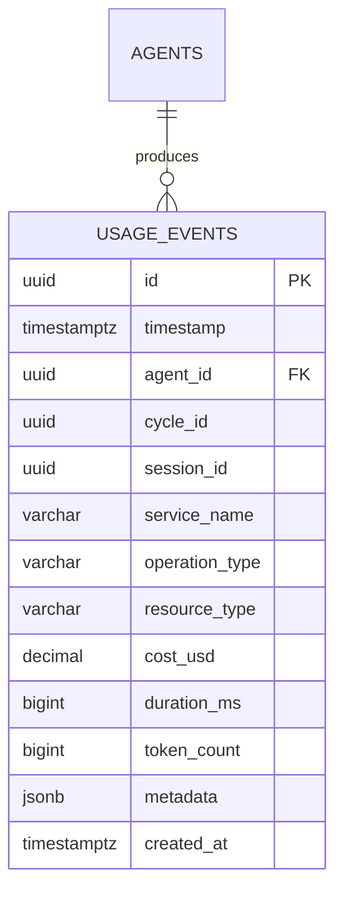

# ERD: Usage Entity Group

**FSD Requirement**: FR-1.2

---

## Overview

The Usage entity group tracks per-operation usage data for billing, cost attribution, and analytics. Currently contains one physical table: `usage_events`.

---

## Diagram

---

## Relationship Descriptions

### AGENTS → USAGE_EVENTS

- **Cardinality**: 1:N (one agent produces many usage events)
- **FK Column**: `usage_events.agent_id` references `agents.id`
- **Status**: FK constraint not yet enforced — referenced table `agents` does not exist
- **Delete Behavior**: Deferred. When `agents` table is created, recommend `ON DELETE RESTRICT` — usage events are historical records and should not be silently deleted with an agent
- **Soft Delete**: Not applicable. Usage events are immutable historical facts

### Planned Relationships

| Column | Target | Cardinality | Notes |
|--------|--------|-------------|-------|
| `cycle_id` | `cycles(id)` | N:1 | Grouping events into billing/execution cycles |
| `session_id` | `sessions(id)` | N:1 | Grouping events into user sessions |

---

## Tables

| Table | Purpose | Status |
|-------|---------|--------|
| `usage_events` | Per-operation usage tracking for billing and attribution | **Implemented** |

---

## Cascade & Delete Behavior

- **No CASCADE deletes defined.** FK constraints deferred until referenced tables exist.
- **Immutability**: Usage events represent historical facts. Hard deletes should only occur via archiving queries (e.g., `ArchiveOldUsageEvents`), never via application logic.
- **Soft delete**: Not implemented. The table has no `deleted_at` column — by design, events are permanent records.

---

## Notes

- This ERD will expand as additional Usage tables (`cost_tracking`, `billing_periods`) are created.
- Mermaid syntax is validated by `mmdc` CLI in CI/CD pipeline.
- See `master.md` for cross-group relationships.
